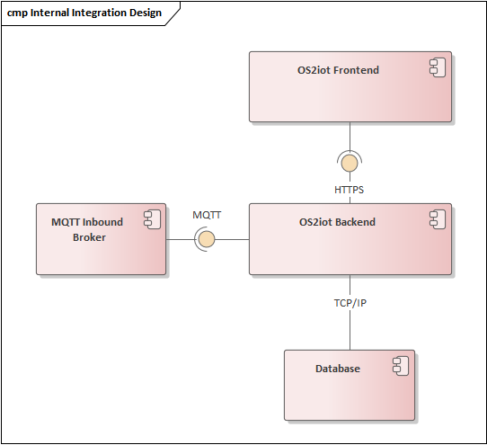
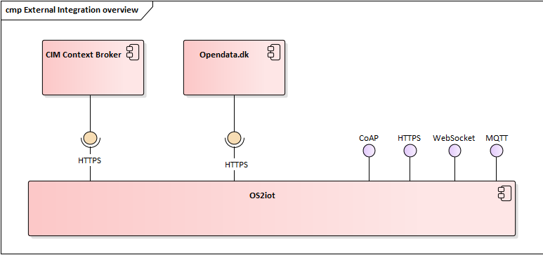
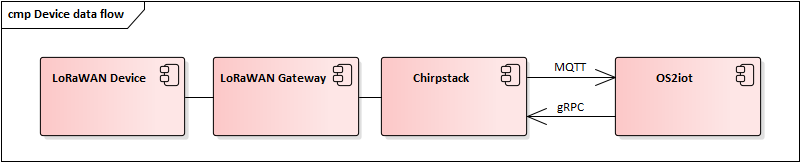

External Interface Design
====================================

This document describes the external interface design of OS2iot. This
includes an overview of the interfaces, the internal and external
integration patterns, and the details of both incoming and outgoing
integrations (IoT device and data target, respectively).

Interfaces
-------------------------------------------------------------------

This figure shows an overview of the external interfaces of OS2iot, each will be explained later in seperate sections.

|image1|

Integration patterns
-------------------------------------------------------------------

Internal systems
^^^^^^^^^^^^^^^^^^^^^^^^^^^^^^^^^^

Internally, OS2iot consists of five components shown in this figure.

|image2|

Two different patterns are used between the internal components:

-  | **Request-response**
   | Used between the frontend, backend and database.

-  | **Publish-subscribe**
   | Used in communication between the backend and MQTT broker for Chirpstack and the internal MQTT broker.

External systems
^^^^^^^^^^^^^^^^^^^^^^^^^^^^^^^^^^

External system integrations for OS2iot are divided into three groups:

-  IoT devices

-  Data targets

-  Authentication

IoT devices
~~~~~~~~~~~

|image3|

Figure 3 - IoT device integration overview

All IoT device integrations except LoRaWAN and MQTT use callbacks to send data to
OS2iot using HTTPS in a request-response manner. Device management for 
Sigfox (i.e. adding and modifying IoT devices) is done by
sending requests to Sigfox's Cloud backend.

MQTT devices uses the MQTT protocol to communicate with the broker.

Data from Chirpstack devices are sent to OS2iot through Chirpstack using
MQTT, where Chirpstack is the publisher and OS2iot is the subscriber.
Device management is done from OS2iot by sending gRPC requests to
Chirpstack.

Data targets
^^^^^^^^^^^^^^^^^^^^^^^^^^^^^^^^^^

|image4|

OS2iot supports integrations to:

-  Opendata.dk

-  HTTP(S) Push data targets

Authentication
^^^^^^^^^^^^^^^^^^^^^^^^^^^^^^^^^^

|image5|

OS2iot integrates to the external authentication system: KOMBIT Adgangsstyring.
See `the seperate page for KOMBIT adgangsstyring <../kombit-adgangsstyring/kombit-adgangsstyring.html>`_.

IoT Device Integrations
-------------------------------------------------------------------

*This section describes the IoT device integrations. This covers both
upstream and downstream messages, registering new devices etc. Each
subsection covers a specific technology.*

Generic IoT Device
^^^^^^^^^^^^^^^^^^^^^^^^^^^^^^^^^^

Several of the protocols shown in *Figure 3 - IoT device integration
overview*, use a generic HTTP endpoint for receiving data. Each device
is identified by an API-key which is a UUID, this is passed as a URL
parameter. This endpoint validates that the incoming data is JSON and
that the device exists, by validating the API-key, in the database
before the data is passed added to Kafka to be further processed.

Swagger:
`/api/v1/receive-data <https://test-os2iot-backend.os2iot.dk/api/v1/docs/#/Receive%20Data/ReceiveDataController_receive>`__

NB-IoT (Telia)
^^^^^^^^^^^^^^^^^^^^^^^^^^^^^^^^^^

NB-IoT devices are supported in OS2iot using the endpoint for receiving data from generic IoT devices as described in section 4.1. There are several reasons for this:

1.	NB-IoT devices often come bundled with a proprietary backend that devices are hardcoded to send data to. From this backend, data can be sent to other systems such as OS2iot. Other devices might be configurable to send data to a specific endpoint. This heterogenous setup makes it very difficult to make general assumptions for how NB-IoT devices send data to OS2iot.
2.	NB-IoT devices are typically managed either by the provider of the NB-IoT network or by another third party. This means that while it is possible to build NB-IoT device management functionality in OS2iot using the Ericsson DCP Platform, this will likely be redundant functionality in almost all cases.

LoRaWAN (Chirpstack)
^^^^^^^^^^^^^^^^^^^^^^^^^^^^^^^^^^

`Chirpstack <https://chirpstack.io>`_ is used to communicate with LoRaWAN
IoT devices. This means that OS2iot communicates with Chirpstack, which
in turn communicates with gateways and devices.

This in turn means, that data must be synchronized between Chirpstack
and OS2iot, such that LoRaWAN devices created in OS2iot are also created
in Chirpstack.

Data from IoT devices is received by Chirpstack and sent to OS2iot by
publishing to a MQTT broker which has OS2iot as a subscriber.

Data sent to IoT devices is sent from OS2iot to Chirpstack using gRPC. Communication between the IoT devices, gateways
and Chirpstack is out of scope of this project.

|image6|

In Chirpstack V4, the Application and network server has been merged into the same component.

1. `Gateway bridge <https://www.chirpstack.io/docs/chirpstack-gateway-bridge/>`__

2. A postgresql database

3. An MQTT Broker

4. `Chirpstack <https://www.chirpstack.io/docs/>`__

Data synchronization
~~~~~~~~~~~~~~~~~~~~

Some data must be always be synchronized between OS2iot and Chirpstack.
This includes:

-  Applications

-  Gateways

-  IoT devices

-  Device profiles

-  Multicast groups.

Changes to these entities must always happen in OS2iot, which is then
synchronized to Chirpstack. It is not supported to change data directly
in Chirpstack. The protocol documentation for the api is documented at https://www.chirpstack.io/docs/chirpstack/api/api.html.

Security
~~~~~~~~

OS2iot and Chirpstack have separate security models and do not share
users. Instead, all communication between OS2iot and Chirpstack is done
using a service account with administrator permissions in Chirpstack.

For communicating with the chirpstack api, it is necessary to create a apikey on Chirpstack, which you must insert in the environment variable: :code:`CHIRPSTACK_API_KEY`.

This apikey is included in the header in every call to the Chirpstack api and has the format of an Bearer token:

.. code-block:: typescript

      makeMetadataHeader(): Metadata {
        const metadata = new Metadata();
        metadata.set("authorization", "Bearer " + configuration()["chirpstack"]["apikey"]);
        return metadata;
    }

Prerequisites 
""""""""""""""""""""""""""""""

In order to use the Chirpstack for LoRaWAN devices certain things has to be set up.

-  Gateway

   -  Register gateway

-  Devices

   -  Create device profile

   -  Register device

Error handling
~~~~~~~~~~~~~~

Errors which occur in integrations are handled and logged as much as possible.
If the action was caused by a user, then the user will receive an error message detailing this.
If the error occured without it being caused by a user, e.g. IoT-device sends data, then the error will be logged.

Communicating with edge devices
~~~~~~~~~~~~~~~~~~~~~~~~~~~~~~~

REST API is the easiest way to send payloads to edge devices. Retrieving data is done via MQTT.

Reading data

-  **Join** - Event published when a device joins the network. Please
   note that this is sent after the first received uplink (data) frame.

-  **Status** - Event for battery and margin status received from
   devices.

-  **Uplink** - Contains the data and meta-data for an uplink
   application payload.

-  **Ack** - Acknowledgements event published on downlink frame.

-  **TxAck** - Event published when a downlink frame has been
   acknowledged by the gateway for transmission

-  **Error** - Event published in case of an error related to payload
   scheduling or handling. E.g. in case when a payload could not be
   scheduled as it exceeds the maximum payload-size.

Register new device
~~~~~~~~~~~~~~~~~~~

Devices can be registered and activated on the network by to different
means. Over-the-Air Activation (OTAA) and Activation by Personalization
(ABP) Over-the-Air Activation (OTAA) is the most secure way to connect
with Network. The network assigns a dynamic DevAddr and negotiate
security keys with the device. In other cases the DevAddr as well as the
security keys is hardcoded in the device. This means activating a device
by personalization (ABP). "Device profile" has to
be set in order to register a device. The *Device Profile* defines the
boot **parameters** that are needed by the ChirpStack Server to
“connect” with a edge device.

.. _update-existing-device-1:

MQTT
^^^^

There are two kinds of MQTT devices available. MQTT external broker and MQTT internal broker. These two devices works in different matters which will be described below.

MQTT external broker
~~~~~~~~~~~~~~~~~~~~~~
The MQTT external broker device will make it possible for a physical device to communicate with the internal OS2IoT mosquitto broker.
The MQTT external broker is created in the OS2IoT backend and is created with the credentials that the device needs for communicating with the internal broker.

The MQTT external broker device can either be created with username/password or credentials. If the publisher is created with username/password it will use port 8885, and if created with certificate it will use port 8884.

When a physical MQTT device will publish some data, then OS2IoT will check for the specific topic that the device is publishing to in the database, and if the topic is set in the database, it will process the data.
If a MQTT external broker device with the specific topic isn't created then the broker won't be able to find it in the database and therefore it will reject the data.

The specific topic for the created device will be :code:`device/organizationID/applicationID/deviceID`.

MQTT internal broker
~~~~~~~~~~~~~~~~~~~~~

The MQTT internal broker uses the MQTT protocol to subscribe to a topic on an external MQTT broker. A client is created in the OS2IoT backend.
This client will connect to the external MQTT broker using the provided URL, port and authentication, and then subscribe to data on the provided topic.

OS2IoT doesn't have any knowlegde of the external broker so it's totally up to the user to provide the different inputs.
If the input isn't valid and a connection can't be made to the external broker, a flag will be set in the database which tells OS2IoT that the connection can't be made and then OS2IoT will stop trying to connect to the external broker.

If the inputs from the user IS valid, then a connection will be made and the device will listen to any updates from the broker.

The MQTT internal broker device has the possibility to use either certificate or username/password to a external broker if needed.

Sigfox
^^^^^^^^^^^^^^^^^^^^^^^^^^^^^^^^^^

The Sigfox integration is a RESTful API over HTTP. They utilize the HTTP
verbs (POST, GET, DELETE, PUT), and are based on the JSON format. Their
documentation is located at
https://support.sigfox.com/apidocs#section/API-overview.

In Denmark the SigFox network is operated by “IoTDenmark”:
https://iotdk.dk/sigfox-iot/.

In SigFox’es information model they have “DeviceTypes” and “Group”,
these can loosely be translated to “Applikation” and “Brugergruppe” in
the OS2IoT model. Alternatively the integration could be implemented using
just one DeviceType and one group for an entire OS2IoT installation.

The API is rate-limited, meaning that if too many requests are sent
within a short timeframe, a 429 too many requests will be sent back.

.. _register-new-device-2:

Register new device
~~~~~~~~~~~~~~~~~~~

Before being able to register a new device, it’s required to have a
DeviceType, which in turn requires a Group.

To register a new device, the “createDevice” API endepoint is called
with the POST method. Here OS2IoT need to provide an id, a name, a
deviceType and a “Porting Access Code” (PAC). The endpoint returns the
unique identifier which the device is identified as by SigFox, this must
be saved for future calls.

SigFox’es documentation for the API is located at:
https://support.sigfox.com/apidocs#operation/createDevice

.. _update-existing-device-2:

Update existing device
~~~~~~~~~~~~~~~~~~~~~~

.. _receive-data-1:

Receive data
~~~~~~~~~~~~

**To receive data SigFox recommends using their callback system (in
other words WebHooks). That is when an IoT device sends a message to the
SigFox network, SigFox will call-back to OS2IoT, with the information
from the IoT device.**

There exists three types of callbacks, DATA, SERVICE **and** ERROR.
Under DATA there is two types, UPLINK and BIDIR (bidirectional), where
UPLINK is probably the most common one for us to use. Under SERVICE,
there is STATUS, ACKNOWLEDGE and DATA_ADVANCED. Here DATA_ADVANCED is
interesting, as it allows us to geolocate and get metadata, but comes at
the cost of a 30second delay, see
https://build.sigfox.com/backend-callbacks-and-api#callbacks for more.

To achive this, OS2IoT must first create a callback configuration at SigFox
using the API.

The callback is defined for one DeviceType, which means that OS2IoT will
either have to implement one callback for all devices or one for each
application in OS2IoT. Though they can be registered to the same URL.

They support three channels of callback: URL, BATCH_URL and EMAIL. URL
means that Sigfox will produce one callback for each IoT device
transmission, BATCH_URL means that data is pushed at most once pr.
Second and contains all packages in that timeframe.

OS2IoT must also define the body of information it wish to receive as the
bodyTemplate parameter.

More information about the custom callback features are located here:
https://support.sigfox.com/docs/custom-callback-creation

SigFox’es documentation for the API is located at:
https://support.sigfox.com/apidocs#operation/createCallback

To receive this information from the callback, OS2IoT must construct an
endpoint for it to call.

To check if OS2IoT missed any callbacks OS2IoT could periodically call the
callback errors API for each device type. It will return all the failed
callbacks:
https://support.sigfox.com/apidocs#operation/getCallbackMessagesErrorListForDeviceType

If downlink communication (from OS2IoT to IoT device) is desired, it can
be achived using the callback or by giving the data to Sigfox for them
to pass along to the device. See
https://support.sigfox.com/docs/downlink-callbacks for more.

.. _restart-device-1:

Restart device
~~~~~~~~~~~~~~

It’s possible to restart multiple devices via their unique identifiers
or to restart all devices of a certain type. Both methods are
asynchronous via the Job concept in Sigfox. To restart multiple device
the API: https://support.sigfox.com/apidocs#operation/devicesBulkRestart
is used. And to restart the devices of a given type the API:
https://support.sigfox.com/apidocs#operation/deviceTypeBulkRestart is
used. At a later point the bulk job status API can be used:
https://support.sigfox.com/apidocs#operation/getBulkJobForDevice.

Data Targets
------------

This section describes the different possible data target types in
OS2IoT, i.e. how incoming data from the IoT devices can be sent to
receiving systems. 

HTTP Push
^^^^^^^^^

HTTP Push is an method of integrating via registering a callback and then
having the capability of receiving it. This is also how the SigFox
integration works. The main advantage is that the initiator of the call
is the party which knows that new information is available, thus
needless pooling is avoided.

To support HTTP Push as part of OS2IoT, the user should be allowed to
define the URL on which they’ll receive the callbacks, moreover the
communication should be encrypted (over HTTPS) and using a way of
authentication (HTTP basic Auth; or a secret header/url-parameter
definded by the user, configured in OS2IoT).

If the receiver of the data want a higher level of assurance, then there
are several ways of achieving it. A simple solution is retrying with an
exponential back-off. Or an API exposing all messages which have not
been acknowledged by the receiver, for a short period of time (for
instance 3 days like SigFox).

MQTT
^^^^^^^^^^^^^^^^

OS2iot supports publishing data to a broker when it's received using MQTT. MQTT is a standard, lightweight messaging protocol based on the publish/subscribe pattern.

When configuring such a data-target, there's a few terms and keywords to be aware of:

- **QoS**: The QoS (Quality of Service) level determines the guarantee of delivery for a specific message. Different network environments may require different QoS levels.
  Ideally, the level should be set to match the network reliability and application logic. This is the main point of MQTT.
  
  There are 3 QoS levels:

  - 0 (at most once)
  - 1 (at least once)
  - 2 (exactly once)

  There are a number of well written articles regarding QoS. One such example is
  `this blog entry <https://www.hivemq.com/blog/mqtt-essentials-part-6-mqtt-quality-of-service-levels/>`_.
- **Topic**: The MQTT data-target must be provided a topic with which it can label the data. This is used by the MQTT broker to filter messages from
  MQTT clients. Here, OS2iot is a client.
- **Connection authentication**: The most common methods of authentication are username and password and/or client certificates. At the time of writing, username and password
  authentication is supported, but it can be extended to implement other methods. 

You can read more on MQTT `here <https://mqtt.org/>`_

FIWARE
^^^^^^

FIWARE data target allows users to integrate OS2IoT with any "Powered by FIWARE" platform by enabling the connection to the Context Broker Generic Enabler.

Data are send to the context broker via the :code:`/ngsi-ld/v1/entityOperations/upsert/` operation. 

The output of the payload decoder function needs to comply with the NGSI-LD format as it is sent as a body of the request without any alteration. It should represent an array of objects to be updated.

The context (part of the NGSI-LD standard) can be provided in the request body or can be defined in the data target configuration. In the latter case, it will be included within the headers of the request.

The Fiware data target supports the multitenancy of the Context Broker (but not every context broker supports multitenancy). The name of the tenant can be specified in the configuration. If no value is provided, the default tenant will be used. To specify the tenant OS2IoT is using :code:`NGSILD-Tenant` header.

If your Context Broker is secured with OAuth2 it's possible to configure target to obtain necessary client credentials from Authentication Server. To do that it's required to provide token endpoint together with Client ID and Client Secret while configuring the target.

Opendata.dk
^^^^^^^^^^^

Users of OS2iot can expose the data sent from their devices to opendata.dk by setting up a data-target to share with opendata.dk.

The IoTDevices whose data is exposed is the devices which are listed in the data-target. The data is transformed using their corresponding payload transformers.
Each data-target which is shared creates one data-set is opendata.dk and in that dataset there is once resouce, namely an HTTP endpoint which exposes the data as an array of JSON objects.

Opendata.dk autogenerates their catalogue of OS2iot data, by parsing the DCAT json file which is exposed at the :code:`​/api​/v1​/open-data-dk-sharing​/{organizationId}` endpoint. 
The organizationId for your organization is shown in the frontend. 

The data itself is exposed on the :code:`/api/v1/open-data-dk-sharing/{organizationId}/data/{shareId}` endpoint.

Authorization
~~~~~~~~~~~~~

The endpoints listed above is not protected by a requirement of authorization, since they are intended to be publicly available.

Data and format
~~~~~~~~~~~~~~~

The data exposed is entirely defined by the payload transformer, and thus the user of OS2iot, rather than the system imposing a data format.

KOMBIT Adgangstyring
-------------------------------------------------------------------

See `the seperate page for KOMBIT adgangsstyring <../kombit-adgangsstyring/kombit-adgangsstyring.html>`_

.. |image1| image:: media/image14.png

.. |image3| image:: media/image14.png

.. |image5| image:: media/image9.png

.. |image7| image:: media/image12.png
.. |image13| image:: media/image13.png
