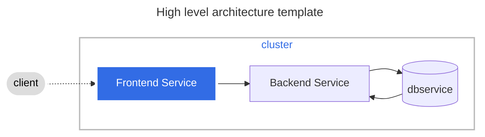

# Title

Intro

## What you'll need

🕜 xx minutes

🗄️ A git repository

📦   Some services packed as OCI containers

☸️  A cluster with container orchestration

🔎 A way to monitor and observe the deployment

## 🗺️ Overview of moving parts

## ⬇️ Installation steps

Short intro explaining in value terms, what you have when youre done following the steps..

### 1️⃣ - One-sentence description of the step

{Optionally, introduce this section with brief explanatory text.}

Instructions

{Optional: include a code snippet or relevant screenshot that helps your users complete the steps.}

{Optional: show the result of completing this step, such as a text output or an image).}

### 2️⃣  - One-sentence description of the step

{Optionally, introduce this section with brief explanatory text.}

Instructions

{Optional: include a code snippet or relevant screenshot that helps your users complete the steps.}

{Optional: show the result of completing this step, such as a text output or an image).}

### 🔚  Post installation

{Provide an overview of options or link to other relevant documentation once installation has been completed. Also, account for anticipated problems during or after installation.}

### 🚨  Troubleshooting

{Provide an overview of typical errors and ways to get around them}
