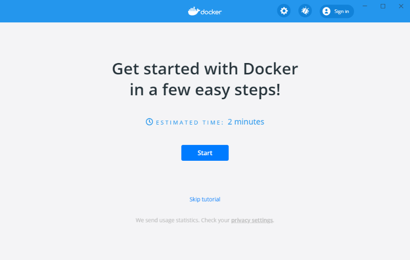
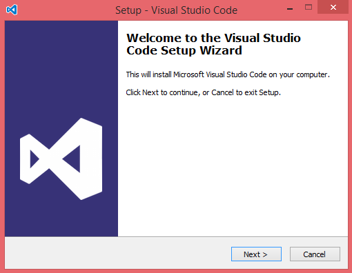
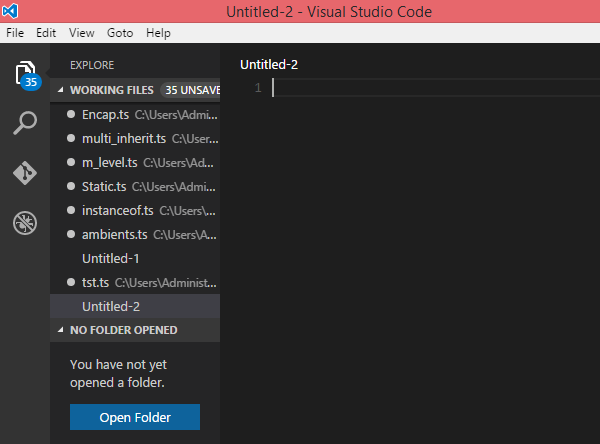
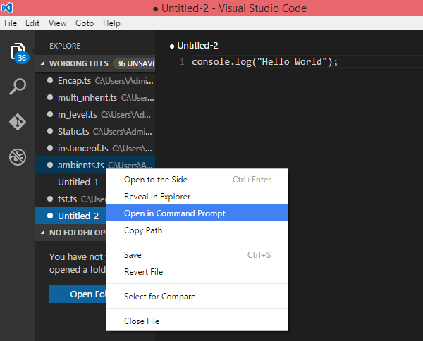
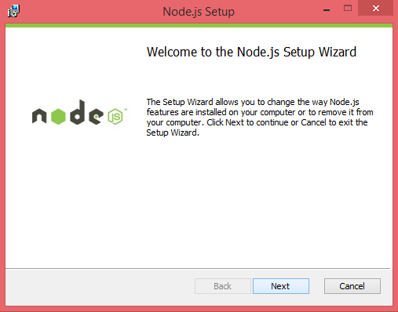
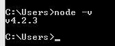

Installation Guide
============================

Introduction
------------

Purpose
~~~~~~~

Target audience
~~~~~~~~~~~~~~~

Definitions and abbreviations
~~~~~~~~~~~~~~~~~~~~~~~~~~~~~

Delimitations
~~~~~~~~~~~~~

Prerequisites
~~~~~~~~~~~~~

Environment variables
~~~~~~~~~~~~~~~~~~~~~

======== ================= =========================== ===========================
Variable Development       Internal test               External test
======== ================= =========================== ===========================
[APPURL] http://os2iot-dev https://os2iot-internaltest https://os2iot-externaltest
======== ================= =========================== ===========================

Docker configuration
--------------------

OS2IoT Backend
~~~~~~~~~~~~~~

.. code:: shell

   git clone https://github.com/OS2iot/Os2iot-backend
   cd Os2iot-backend
   docker build -t Os2iot-backend .
   docker run --name os2iot-api -d -p 49160:8080 Os2iot-backend

Chirpstack
~~~~~~~~~~
.. code:: shell

   docker pull chirpstack/chirpstack-network-server
   cd chirpstack-docker
   docker-compose up

After setting up the chirpstack docker container. The API documentation
will be exposed on http://localhost:8080/api . More information can be
found on https://www.chirpstack.io/application-server/integrate/rest/

https://www.chirpstack.io/application-server/install/config/

Install standard software
-------------------------

Install Docker Desktop
~~~~~~~~~~~~~~~~~~~~~~

**Requirement: Docker account**

1. Double-click Docker Desktop Installer.exe to run the installer.

2. If you haven’t already downloaded the installer (Docker Desktop
   Installer.exe), you can get it from \ `Docker
   Hub <https://hub.docker.com/editions/community/docker-ce-desktop-windows/>`__.
   It typically downloads to your Downloads folder, or you can run it
   from the recent downloads bar at the bottom of your web browser.

3. When prompted, ensure the **Enable Hyper-V Windows Features** option is selected on the Configuration page.

4. Follow the instructions on the installation wizard to authorize the
   installer and proceed with the install.

5. When the installation is successful, click **Close** to complete
   the installation process.

6. If your admin account is different to your user account, 
   you must add the user to the *docker-users* group. 
   Run *Computer Management* as an administrator and 
   navigate to *Local Users and Groups > Groups > docker-users* 
   Right-click to add the user to the group. Log out and log back in for the changes to take effect.

Start Docker Desktop
^^^^^^^^^^^^^^^^^^^^

Docker Desktop does not start automatically after installation. To start
Docker Desktop, search for Docker, and select \ **Docker Desktop** in
the search results.

|search for Docker app|

When the whale icon in the status bar stays steady, Docker Desktop is
up-and-running, and is accessible from any terminal window.

|whale on taskbar|

If the whale icon is hidden in the Notifications area, click the up
arrow on the taskbar to show it. To learn more, `see Docker
Settings. <https://docs.docker.com/docker-for-windows/#docker-settings-dialog>`__

When the initialization is complete, Docker Desktop launches the
onboarding tutorial. The tutorial includes a simple exercise to build an
example Docker image, run it as a container, push and save the image to
Docker Hub.

|Docker Quick Start tutorial|

Visual Studio Code
~~~~~~~~~~~~~~~~~~

This is an open source IDE from Visual Studio. It is available for Mac
OS X, Linux and Windows platforms. VScode is available at
− \ `https://code.visualstudio.com/ <https://code.visualstudio.com/?utm_expid=101350005-25.TcgI322oRoCwQD7KJ5t8zQ.0>`__

**Step 1** − `Download Visual Studio
Code <https://code.visualstudio.com/docs?dv=win>`__ for Windows.

|Download Visual Studio-kode|

**Step 2** − Double-click on VSCodeSetup.exe  to launch the setup
process. This will only take a minute

|Opsætningsguide|

**Step 3** − A screenshot of the IDE is given below.

|IDE|

Step 4 − You may directly traverse to the file’s path by right clicking
on the file → open in command prompt. Similarly, the Reveal in Explorer
option shows the file in the File Explorer.

|Sti til krydsfiler|

Installing Node.js
~~~~~~~~~~~~~~~~~~

Node.js is an open source, cross-platform runtime environment for
server-side JavaScript. Node.js is required to run JavaScript without a
browser support. It uses Google V8 JavaScript engine to execute code.
You may download Node.js source code or a pre-built installer for your
platform. Node is available here
− \ `https://nodejs.org/en/download <https://nodejs.org/en/download/>`__

**Installation on Windows**

Follow the steps given below to install Node.js in Windows environment.

**Step 1** − Download and run the .msi installer for Node.

|Download og kør installationsprogram|

**Step 2** − To verify if the installation was successful, enter the
command \ **node –v** in the terminal window.\ |Verify Installation|

.. |image0| image:: ./media/image4.emf
   :width: 1.51111in
   :height: 0.23194in
.. |search for Docker app| image:: ./media/image5.png
   :width: 2.61153in
   :height: 2.35655in
.. |whale on taskbar| image:: ./media/image6.png
   :width: 2.20903in
   :height: 0.50417in

.. |Download Visual Studio-kode| image:: ./media/image8.png
   :width: 3.7913in
   :height: 2.67872in

