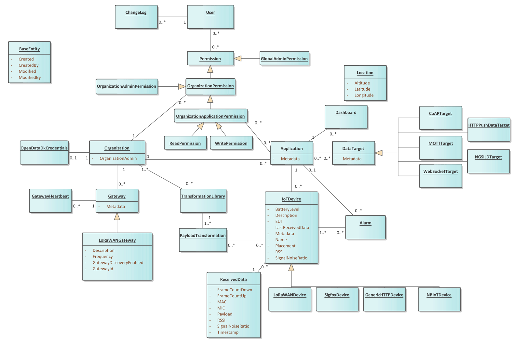

Logical Datamodel
===============================

Introduction
------------

The purpose of this deliverable is to describe the logical data-entities
that are part of the solutions domain together the relationship between
them.

The target audience of the deliverable are:

-  The developers, who need to understand the design, and prepare the
   detailed design and eventually implement the solution

-  Participants and decision-makers from the customer who are
   responsible for the functional design

Scope
~~~~~

This is not a database model, but a logical model of the relationship
between business objects.

Logical Datamodel
-----------------

|image1|

Entity metadata
---------------

Unique identifier
~~~~~~~~~~~~~~~~~

Each entity has an id attribute, which is a persistent unique identifier
for an object. This will never change for an object. The identifier is
only unique for this entity, meaning that object of different entities
can have the same id value.

Temporal values
~~~~~~~~~~~~~~~

Data in OS2iot is non-temporal. Each entity has "created" and "modified"
attributes which contains the date and time an object was created and
last modified, respectively. If an object has been created but not
modified, "created" and "modified" contain the same values.

Each entity also has "createdBy" and "modifiedBy" attributes, which
contain the username of the user that created the object and the last
person to modify an object. If an object has been created but not
modified, "created" and "modified" contain the same values.

Enumerations
------------

This section contains the relevant enumerations in OS2iot.

PermissionLevel
~~~~~~~~~~~~~~~

1. Read
2. Write
3. OrgAdmin
4. GlobalAdministrator

.. |image0| image:: ./media/image3.emf
   :width: 1.51111in
   :height: 0.23194in

