Maintenance Guide
=========================

Introduction
------------

Purpose
~~~~~~~

The purpose of this document is to enable the application management
team to service the solution in production and develop changes for the
solution.

The target audience for the deliverable is either Netcompany AMC or the
customers application management team that supports the solution in
production.

Development
-----------

Requirements
~~~~~~~~~~~~

-  **Docker** – sign up for an account and download docker at
   https://docs.docker.com/get-docker/

-  **NodeJS** – download the latest version at https://nodejs.org/en/

-  **PGAdmin** – download at https://www.pgadmin.org/download/

For futher instructions for installation of standard software go to
`O0100 – installation
guide <https://goto.netcompany.com/cases/GTE720/ERHIO2/Deliverables/Migreret%20til%20Git%20(DONT%20MODIFY!)/D0100%20-%20User-Interface%20Guidelines.docx?web=1>`__

Setup developement
~~~~~~~~~~~~~~~~~~

To setup your dev environment please follow these instructions:

**Step 1** - Get solution from Github. See 4.14.1 Source control and
pull the OS2IoT-docker, OS2IoT-backend, and OS2IoT-frontend.

**Step 2 -** Install typescript and angular globally on your computer .

-  **Angular 9** – install by open command prompt and type

npm install -g @angular/cli

-  Typescript – install by open command prompt and type

npm install -g typescript

Quick 
^^^^^^

Important! Prepare by setting up the repositories, OS2IoT-docker,
OS2IoT-backend, and OS2IoT-frontend, in the same folder/path of your
choosing

Add os2iot-docker to file share in docker 

-  Open Docker Desktop -> Settings -> Resources -> FILE SHARING -> add os2iot-docker as shared folder.

Open command prompt and go to path of OS2IoT-docker and write

Docker-compose up

Hereafter the docker will install the backend and frontend and you can
see the UI result on http://localhost:4200/

To quite, you can press Ctrl + C two times and docker will shut down
safely.

Common errors
^^^^^^^^^^^^^
Error: Issue connecting to chirpstacks PostgreSQL.

Fix:
Goto os2iot-docker in your a terminal

-  Run: docker volume ls

Located the image name os2iot-docker_postgresqldata and delete it by running:

-  docker-compose down

-  docker volume rm os2iot-docker_postgresqldata

Add os2iot-docker to docker files share (se steps above).
Once the path is added run:

-  docker-compose up

Advanced 
^^^^^^^^^

Important! Prepare by setting up the repositories, OS2IoT-docker,
OS2IoT-backend, and OS2IoT-frontend, in the same folder/path of your
choosing

1 Open command prompt and go to path of OS2IoT-docker and write

docker-compose up chirpstack-network-server postgresql
chirpstack-gateway-bridge chirpstack-geolocation-server
chirpstack-application-server os2iot-outbound-mosquitto mosquitto redis
os2iot-inbound-mosquitto os2iot-kafka os2iot-postgresql os2iot-zookeeper
os2iot-backend

|image1|

Docker will install all dependencies to the backend, and you can go to
`http://[::1]:3000/api/v1/docs/ <http://[::1]:3000/api/v1/docs/>`__ and
the result should look like the below picture.

|image2|

2 Open command prompt and go to path/folder of OS2IoT-frontend and write

npm install

|image3|

It will then install all the npm dependencies to the solution.

1 Open command prompt and go to path of OS2IoT-docker and write

Npm start

|image4|

Database
^^^^^^^^

To see the data you have to install PGAdmin as described in 2.1
Requirements.

Open PGAdmin

|image5|

Add a new server

|image6|

Name the server

|image7|

Fill in the connection tab with the following information

|image8|

You can checkout the information(password, port, username) to the server
setup in C:\repos\OS2IoT\OS2IoT-docker\docker-compose.yml. and scroll
down to os2iot-postgresql

|image9|

Configuration of developer laptop
~~~~~~~~~~~~~~~~~~~~~~~~~~~~~~~~~

The following must be installed in order to develop on OS2iot. It is
assumed a Windows laptop is used.

1. Docker Desktop

2. Visual Studio Code with the following extensions:

   a. ESLint

   b. Npm

   c. Jest

   d. Prettier

3. Pgadmin

4. Git/Git Extensions/Sourcetree/Sublime Merge

Mac:
In order to run os2iot-backend outside docker and connect to docker (run it via vs code) one must follow the steps below:

* Add docker to hosts on mac

* Run: sudo vim /etc/hosts

* In vim type i to insert

* Add line with ip and hosts.docker.internal e.g. 127.0.0.1 hosts.docker.internal

* type: esc :wq to save and exit

* start os2iot-backend in vs code via the terminal: npm run start

Map
~~~
OS2IoT maps are running on the Leafletjs framework: https://leafletjs.com/. The tiles are current presented using OpenStreetMap: https://www.openstreetmap.org.

The tiles can be changed by following the steps listed below: 

1. Find "map.component.ts" in the frontend project

2. Within the initMap() method, replace L.tileLayer('https://{s}.tile.openstreetmap.org/{z}/{x}/{y}.png') with the desired tiles

   a. Make sure you also change the attribution attribute.

Note that the solution must be deployed before the changes takes presence.

Database
^^^^^^^^

The database is created code first using TypeORM.

Database changes are done using the TypeORM migrations.

Debugging 
^^^^^^^^^^

Debug VSCode 
'''''''''''''

One of the key features of Visual Studio Code is its debugging support.
VS Code's built-in debugger helps accelerate edit, compile and debug
loop. The solution is setup to debug on a firefox browser and therefore
you have to install the **Debugger for Firefox** extension. Go to
extension and search for **Debugger for Firefox and install it.**

|image10|

Afterwards you can start debugging the code by adding a breakpoint
somewhere.

|Debugging diagram|

If running and debugging is not yet configured (no launch.json has been
created) VSCode show the Run start view.

|Simplified initial Run and Debug view|

To run or debug a simple app in VS Code, press F5 and VS Code will try
to run your currently active file.

However, for most debugging scenarios, creating a launch configuration
file is beneficial because it allows you to configure and save debugging
setup details. VS Code keeps debugging configuration information in
a launch.json file located in a .vscode folder in your workspace
(project root folder) or in your \ `user
settings <https://code.visualstudio.com/docs/editor/debugging#_global-launch-configuration>`__ or `workspace
settings <https://code.visualstudio.com/docs/editor/multi-root-workspaces#_workspace-launch-configurations>`__.

To create a launch.json file, open your project folder in VS Code
(File > Open Folder) and then select the Configure gear icon on the Run
view top bar.

Debug VSCode with Chrome
''''''''''''''''''''''''

If you want to use Chrome as the default browser for debugging you have
to install **debugger for chrome** in the extension menu. Afterwards got
to launch.json in the .vscode folder and add the following configuration

|image13|

Branching strategy
~~~~~~~~~~~~~~~~~~

OS2IoT uses git and GitFlow
https://datasift.github.io/gitflow/IntroducingGitFlow.html for source
code version control.

|A successful Git branching model » nvie.com|

GitFlow involves the following branches:

-  "master" - The main industry with the current code in production.

-  “develop” - The main development industry. Created from the master
   industry and merges back into master cutting which often only through
   and frees branch. Contains latest development work, but changes can
   not push directly to this branch - we use Instead pull requests
   through Github. If development from a feature branch is not to be
   included in the next release, this should not be merged to develop,
   men instead wait for the correct release branch to be set up.

-  "function" branches - contains code for individual new functions.
   Created from develop block and merge to develop branch via a pull
   request when the new feature is complete.

   -  CRM depot prefixes, industries are with OS2, eg OS2feature /
      somenewfeature

-  “hotfix” branches - contains quick changes to master / release
   branch. Will be merged for master / release via a pull request. After
   a hotfix is ​​merged, downstream branches need to be updated, in most
   cases developed.

-  “release” branches - new releases candidates and is used to deploy a
   version to the test, pre-production and production environments. Each
   gang and liberating branch is created, "required" policies must be
   configured for it, such as:

   -  Reviewers

   -  Low validation

Naming Convention of branches
^^^^^^^^^^^^^^^^^^^^^^^^^^^^^

Naming feature branches follows standard: **feature / Branch name.**

Naming the publishing branches follows standard: **release / Branch
name**

Naming the hotfix branches follows standard: **hotfix / Branch name**

Format of commit message
^^^^^^^^^^^^^^^^^^^^^^^^

A commit must follow the format: [Story ID]: Message. For example: "IOT-1337: Update CreateUserDto to validate birthdays"

By starting commit messages with [Story ID], traceability is obtained
from the code and to the case.

Tools
-----

Source code control
~~~~~~~~~~~~~~~~~~~

Github is used to store the source code for the OS2iot project. It uses
the following repositories:

-  OS2IoT-frontend: https://github.com/OS2iot/OS2IoT-backend

-  OS2IoT-backend: https://github.com/OS2iot/OS2IoT-frontend

-  OS2IoT-docker: https://github.com/OS2iot/OS2IoT-docker

Chirpstack
~~~~~~~~~~
.. code:: shell

   docker pull chirpstack/chirpstack-network-server
   cd chirpstack-docker
   docker-compose up

After setting up the chirpstack docker container. The API documentation
will be exposed on http://localhost:8080/api . More information can be
found on https://www.chirpstack.io/application-server/integrate/rest/

https://www.chirpstack.io/application-server/install/config/

Install standard software
-------------------------

Install Docker Desktop
~~~~~~~~~~~~~~~~~~~~~~

**Requirement: Docker account**

1. Double-click Docker Desktop Installer.exe to run the installer.

2. If you haven’t already downloaded the installer (Docker Desktop
   Installer.exe), you can get it from \ `Docker
   Hub <https://hub.docker.com/editions/community/docker-ce-desktop-windows/>`__.
   It typically downloads to your Downloads folder, or you can run it
   from the recent downloads bar at the bottom of your web browser.

3. When prompted, ensure the **Enable Hyper-V Windows Features** option is selected on the Configuration page.

4. Follow the instructions on the installation wizard to authorize the
   installer and proceed with the install.

5. When the installation is successful, click **Close** to complete
   the installation process.

6. If your admin account is different to your user account, 
   you must add the user to the *docker-users* group. 
   Run *Computer Management* as an administrator and 
   navigate to *Local Users and Groups > Groups > docker-users* 
   Right-click to add the user to the group. Log out and log back in for the changes to take effect.

Start Docker Desktop
^^^^^^^^^^^^^^^^^^^^

Docker Desktop does not start automatically after installation. To start
Docker Desktop, search for Docker, and select \ **Docker Desktop** in
the search results.

|search for Docker app|

When the whale icon in the status bar stays steady, Docker Desktop is
up-and-running, and is accessible from any terminal window.

|whale on taskbar|

If the whale icon is hidden in the Notifications area, click the up
arrow on the taskbar to show it. To learn more, `see Docker
Settings. <https://docs.docker.com/docker-for-windows/#docker-settings-dialog>`__

When the initialization is complete, Docker Desktop launches the
onboarding tutorial. The tutorial includes a simple exercise to build an
example Docker image, run it as a container, push and save the image to
Docker Hub.

|Docker Quick Start tutorial|

Visual Studio Code
~~~~~~~~~~~~~~~~~~

This is an open source IDE from Visual Studio. It is available for Mac
OS X, Linux and Windows platforms. VScode is available at
− \ `https://code.visualstudio.com/ <https://code.visualstudio.com/?utm_expid=101350005-25.TcgI322oRoCwQD7KJ5t8zQ.0>`__

**Step 1** − `Download Visual Studio
Code <https://code.visualstudio.com/docs?dv=win>`__ for Windows.

|Download Visual Studio-kode|

**Step 2** − Double-click on VSCodeSetup.exe  to launch the setup
process. This will only take a minute

|Opsætningsguide|

**Step 3** − A screenshot of the IDE is given below.

|IDE|

Step 4 − You may directly traverse to the file’s path by right clicking
on the file → open in command prompt. Similarly, the Reveal in Explorer
option shows the file in the File Explorer.

|Sti til krydsfiler|

Installing Node.js
~~~~~~~~~~~~~~~~~~

Node.js is an open source, cross-platform runtime environment for
server-side JavaScript. Node.js is required to run JavaScript without a
browser support. It uses Google V8 JavaScript engine to execute code.
You may download Node.js source code or a pre-built installer for your
platform. Node is available here
− \ `https://nodejs.org/en/download <https://nodejs.org/en/download/>`__

**Installation on Windows**

Follow the steps given below to install Node.js in Windows environment.

**Step 1** − Download and run the .msi installer for Node.

|Download og kør installationsprogram|

**Step 2** − To verify if the installation was successful, enter the
command \ **node –v** in the terminal window.\ |Verify Installation|

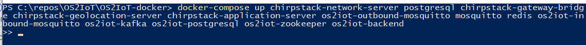
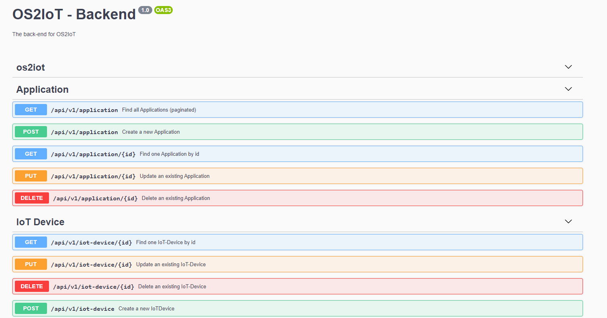
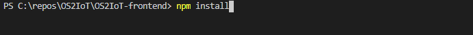
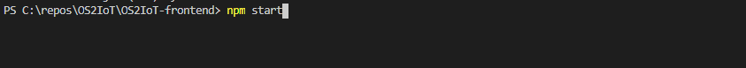
.. |Opsætningsguide| image:: ./media/image9.png
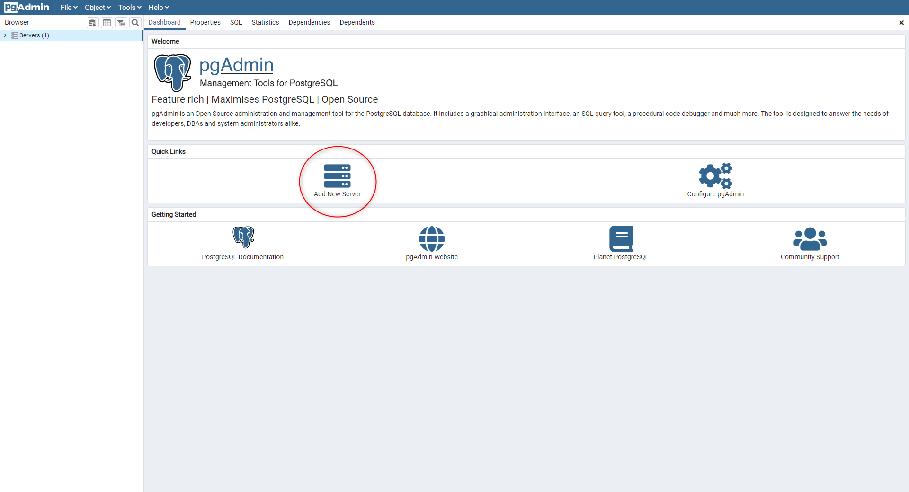
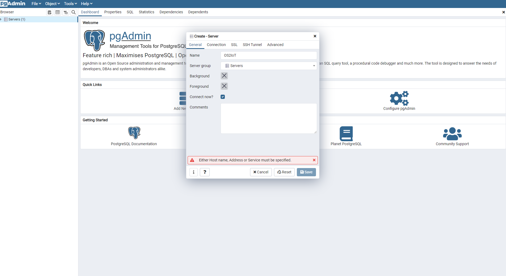
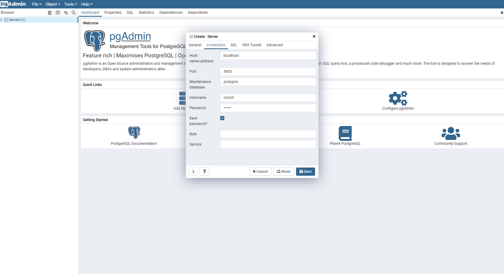
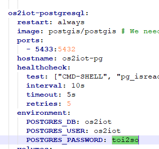

Jenkins
~~~~~~~

Jenkins is used for CI and CD. It can be accessed here:

https://jenkins.os2iot.dk/

Enterprise Architect
~~~~~~~~~~~~~~~~~~~~

The project uses a database hosted in Azure for storing the Enterprise
Architect model. Perform the following steps to establish connection:

1. Open Enterprise Architect

2. Open Server connection

3. Choose "Microsoft OLE DB Provider for SQL Server"

   a. Server name: os2iot-ea.database.windows.net

   b. User name: ea-admin

   c. Password: Found in KeePass

   d. Database: OS2iot

.. |image5| image:: ./media/image9.png

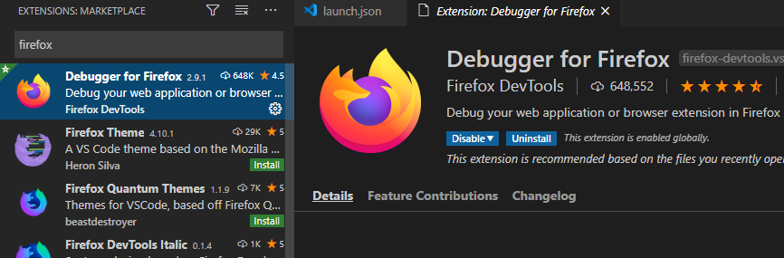
.. |Debugging diagram| image:: ./media/image15.png
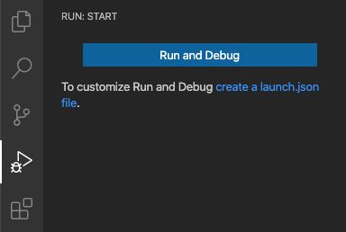
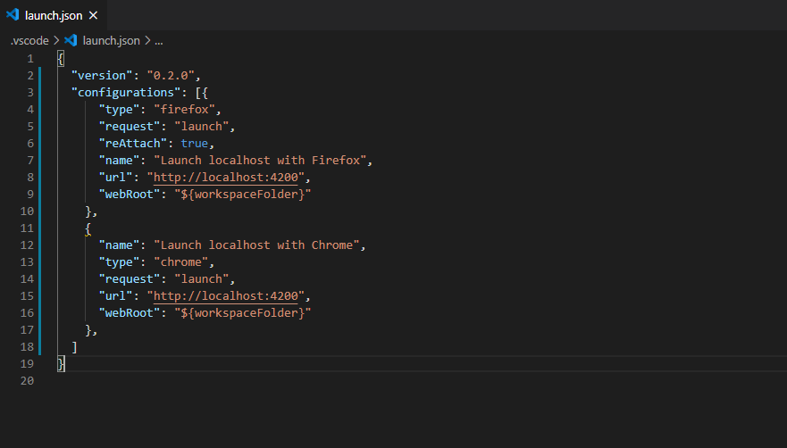
.. |A successful Git branching model » nvie.com| image:: ./media/image18.png
