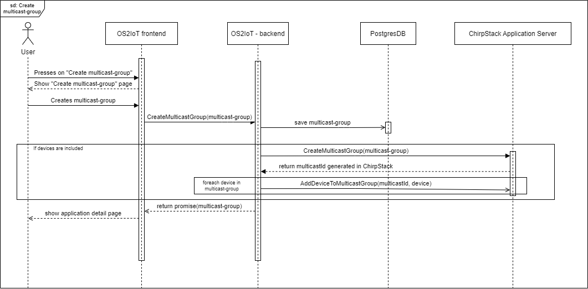

Multicast
======================

This chapter describes the multicast-groups.

What can multicast-groups do?
---------------------------------------------
Multicast-groups make it possible to send a single downlink payload to a group of devices.

A multicast-group consist of some different properties like multicast-address, session-keys and frame counter. All these properties makes it possible to send only one downlink payload to a group
of devices instead of sending many downlink payloads to devices one by one.

Multicast-groups does not support Class-A devices, and at this moment, multicast-groups only supports LoRaWAN devices.

Creation in OS2IoT
-------------------
If you want to make a multicast-group in OS2IoT you have to go into a specific application and then create the multicast-group from there.

You have to fill out all the required forms, and in the end you can add some devices. It's required that the devices share the same service profile, which is set when you create a LoRaWAN device.
The multicast-address has to be an 8-character hexadecimal (hex) value, and the network and application session key has to be a 32-character hex value. 

If these requirements are not met, then the multicast-group will not be created.

When you have added the devices that have the same service profile, and have filled out the other forms, then a multicast-group will be created in the database and in Chirpstack.

This sequence diagram describes the flow from the user to the Chirpstack Application Server:
|image1|

Sending downlink payload
-------------------------

When the multicast-group is created it's possible to send a downlink payload to the group of devices. This is done by navigating to the details page of the multicast-group, and from here you have to choose a specific port and a payload that you wish to send to the devices in the Multicast-group.

The downlink payload is sent using Chirpstack which also has the multicast-group with the devices from OS2IoT.  

Explanation of properties
--------------------------

A very short explanation of some of the properties that needs to be fulfilled when creating a multicast-group:

**Multicast address:** An address that defines the multicast-group. Has to be an 8-character hex value.

**Application Session Key:** An application session key used to encrypt the payloads that are send to the multicast-group. Has to be a 32-character hex value.

**Network Session Key:** A network session key is used to compute the message integrity check field of the packets sent to the group. Has to be a 32-character hex value.

----------

