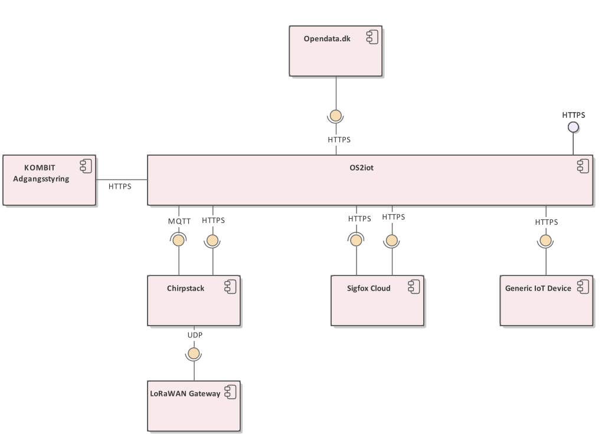
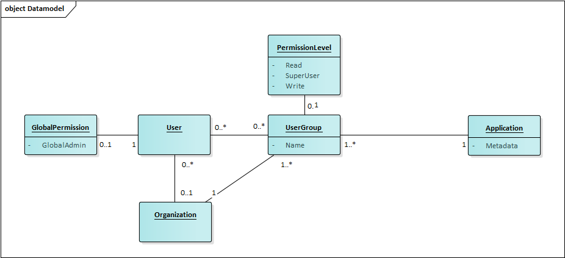
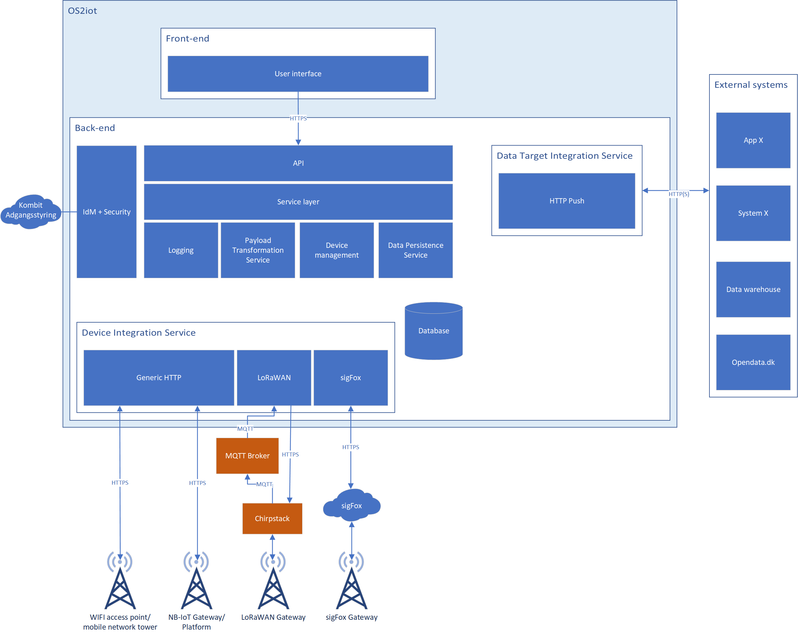
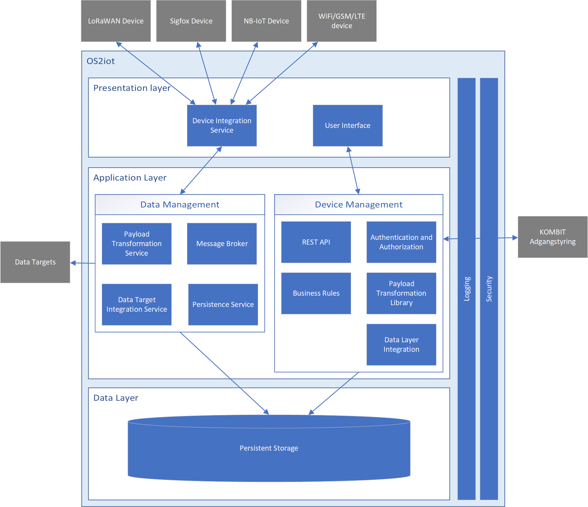

Software Architecture
=====================================

This section describes the logical architecture of OS2iot.

Overview
--------

The solution is divided into a number of logical, loosely coupled
components. This ensures that the solution is extensible with regard to
both supported IoT devices and data targets, and it makes replacing and
maintaining each component simpler. Figure 1 shows an overview of the
different solution components. Orange components are 3\ :sup:`rd` party
solution dependencies that are not developed or maintained in this
project, but are necessary for OS2iot to function

|image4|

Figure 1 - Solution overview

|image5|

Figure 2 - Layered architecture

Logging
~~~~~~~

OS2iot uses the following log types:

-  **System log**: Contains log messages related to the solution such as
   information or errors from internal processes or internal/external
   integrations, views etc. This is stored in the database table
   "SystemLog".

-  **Audit Log**: When a data entity is changed (e.g. an IoT device is
   created or updated) OS2iot logs which user made the change and when
   it was made. This is stored in the database table "ChangeLog".

In addition, the 3\ :sup:`rd` party components used (Chirpstack, MQTT
brokers etc.) contain their own logs according to their documentation.
Refer to section for a specific list of 3\ :sup:`rd` party components.

Integrations
~~~~~~~~~~~~

|image1|

Process perspective
-------------------

Receive IoT device data
~~~~~~~~~~~~~~~~~~~~~~~

See the separate page: `IoT Data management`_.

.. _`IoT Data management`: ../iot-data-handling/iot-data-handling.html

Implementation perspective
--------------------------

OS2iot is implemented using Node.js for the backend and Angular for the
frontend.

3\ :sup:`rd` party components
~~~~~~~~~~~~~~~~~~~~~~~~~~~~~

OS2iot uses the following 3\ :sup:`rd` party components as dependencies:

============ ============================================================================== =========================== ==================== ==============
Component    Use                                                                            Reference                   License              Version
============ ============================================================================== =========================== ==================== ==============
Chirpstack   LoRaWAN device Integration                                                     https://chirpstack.io       MIT License          3
Mosquitto    MQTT broker for LoRaWAN and data target integrations                           https://mosquitto.org/      EPL/EDL License      1.6
Apache Kafka Internal message broker used in the OS2iot backed for device data integrations https://kafka.apache.org/   Apache License 2.0   2.6
PostgreSQL   Persistent data storage                                                        https://www.postgresql.org/ PostgreSQL License   12
Redis        In-memory data store                                                           https://redis.io/           BSD License          5
Docker       Virtualization software                                                        https://www.docker.com/     Apache License 2.0   19.03.13
============ ============================================================================== =========================== ==================== ==============

Backend
~~~~~~~

Technology stack
^^^^^^^^^^^^^^^^

In the backend the following technologies are used:

========== ========================================================================== =============================== ==================
Technology Purpose                                                                    URL                             License
========== ========================================================================== =============================== ==================
Node.js    Server-side Javascript runtime                                             https://nodejs.org/en/          MIT License
Typescript Typesafety and other improvements upon Javascript (compiles to Javascript) https://www.typescriptlang.org/ Apache License 2.0
Jest       Testing framework                                                          https://jestjs.io/              MIT License
TypeORM    Object Relatrional Mapper to our database (persistence)                    https://typeorm.io/             MIT License
Nest.js    Web framework                                                              https://nestjs.com/             MIT License
========== ========================================================================== =============================== ==================

Solution architecture
^^^^^^^^^^^^^^^^^^^^^

A classical three-layer model consisting of the following three layers is used in the backend:

-  Controller layer

   -  Exposes the API endpoints:

      -  To be used by the front-end

      -  To be used by device integrations

      -  To be used by data targets

-  Service layer

   -  Holds business logic

-  Data access layer

   -  Controls all access to the database

Each layer is only capable of accessing the adjacent layers, so the
controller cannot access the data access layer and vice versa.

Frontend
~~~~~~~~

Technology stack
^^^^^^^^^^^^^^^^

========== ============= ================== ===========
Technology Purpose       URL                License
========== ============= ================== ===========
Angular    Web framework http://angular.io/ MIT License
========== ============= ================== ===========

Deployment perspective
----------------------

The solution is deployed as a number of Docker containers.

-  OS2iot Frontend

-  OS2iot Backend

-  Chirpstack

-  LoRaWAN MQTT Broker

-  Postgres

-  Apache Kafka

Docker Compose is used to ease deployment of the solution. 
For scalability and increased robustness, the solution can be deployed to kubernetes cluser.

Of these container only the OS2iot frontend and OS2iot backend
containers are made in the OS2iot project, the remaining is made by
3\ :sup:`rd` parties and used as part of the solution.

Data perspective
----------------

OS2iot contains the following types of data:

-  Device payloads (only the latest payload from a device is stored)

-  Metadata about device payloads (timestamps etc of the latest N
   transmissions or all within a small timeframe)

-  System parameters and configuration

-  User data (usernames, passwords and permissions)

-  Audit logs

-  System logs

-  Application data (applications, devices, alarms, gateways, device
   metadata etc.)

This data is by default stored by the backend in PostgreSQL. The logs
are stored in the filesystem, with the future possibility of ingesting
it into an ELK stack or similar.

Data temporality
~~~~~~~~~~~~~~~~

Data in OS2iot is non-temporal. Each entity has "createdAt" and
"updatedAt" attributes which contains the date and time an object was
created and last modified, respectively. If an object has been created
but not modified, "createdAt" and "updatedAt" contain the same values.

Each entity also has "createdBy" and "modifiedBy" attributes, which
contain the userID of the user that created the object and the last
user to modify an object. If an object has been created but not
modified, "createdBy" and "modifiedBy" contain the same values.

Security perspective
--------------------

This figure shows the classes which make up the permission model for OS2IoT.
A user is part of zero or more permissions (user groups). Each permission has one or more permission types
which determine what's accessible within the organization. The concrete types are as follows:

1. GlobalAdmin
   a. Each domain instance of OS2IoT has at least 1 user with this type, which is created on the first startup of the backend.
   b. Users with the GlobalAdmin role can assign other users to also have the GlobalAdmin role

2. OrganizationApplicationAdmin
   
   a. This relates to a single organization
   b. This relates to a list of users within that organization. Access is granted to parts of the system requiring this type

3. OrganizationGatewayAdmin
   
   a. This relates to a single organization
   b. This relates to a list of users within that organization. Access is granted to parts of the system requiring this type

4. OrganizationUserAdmin
   
   a. This relates to a single organization
   b. This relates to a list of users within that organization. Access is granted to parts of the system requiring this type

5. Read

   a. This relates to a single organization
   b. This relates to a list of applications within that organization

|image3|

User login and permissions
~~~~~~~~~~~~~~~~~~~~~~~~~~

In OS2iot, user authentication is done by either en external system or
by OS2iot. Authorization is handled in OS2iot by assigning users to
either organizations or applications with a given permission level.

This does not comply with "Den fælleskommunale rammearkitektur", which
states that authorization should happen in KOMBIT Adgangstyring if
possible. The reasons for authorization being done in OS2iot instead of
KOMBIT Adgangstyring are:

-  To make user management in OS2iot uniform regardless of where the
   user logs in from.

-  To support separate permissions to organizations and applications,
   along with dynamically created applications.

Authentication
^^^^^^^^^^^^^^

User authentication is handled in one of two systems:

-  KOMBIT Adgangsstyring

-  OS2iot

Authorization
^^^^^^^^^^^^^

By default, a user does not have access to data in OS2iot. A global
admin or User admin must manually give the user permissions to
organizations or applications.

User permissions
^^^^^^^^^^^^^^^^

=================== ============================= ========================================================================
User role           System name                   Permissions
=================== ============================= ========================================================================
Global admin        GlobalAdmin                   Super user, CRUD everything within the domain
Application admin   OrganizationApplicationAdmin  Access and modify applications, DeviceModels and IoT devices within an organization
Gateway admin       OrganizationGatewayAdmin      CRUD gateways within an organization
User admin          OrganizationUserAdmin         CRUD users and permissions within an organization
Read access         Read                          Read all data within an application.
=================== ============================= ========================================================================

Web application security
~~~~~~~~~~~~~~~~~~~~~~~~

This section describes the security measures taken to ensure
conficentiality and integrity of the part of OS2iot that is the web
application. This includes both the frontend and backend of the
solution, but not IoT device integrations or data target integrations.

OS2iot REST API security
~~~~~~~~~~~~~~~~~~~~~~~~~~~~~~

In order to use the REST API exposed by OS2iot, the user must be authenticated.

There are two methods of authentication. The first method is done by using the JWT gained from the :code:`/api/v1/auth/login` endpoint.
The JWT is inserted as a Bearer token in the :code:`Authorization` header of the type :code:`Bearer` as described in RFC 6750, section 2.1.

The second method of authentication involves using an API key generated on the :code:`/api/v1/api-key` endpoint.
An API key is tied to one or more user groups so the access level reflects what each user group is permitted.
It can be created by users with an organization administrator role or higher.

The API key is inserted as text in the :code:`X-API-KEY` header. Note that if a valid JWT token is provided, then API key authentication is skipped.

Device security
~~~~~~~~~~~~~~~

Generic IoT devices
^^^^^^^^^^^^^^^^^^^^^

Generic IoT devices must provide a unique API key with every request to OS2iot. This provides both security and identification of the device sending data. Since the connection uses TLS, the API key is encrypted in the transmission.

LoRaWAN
^^^^^^^

Data from LoRaWAN devices are end-to-end encrypted and protected against
replay attacks
(https://lora-alliance.org/sites/default/files/2019-05/lorawan_security_whitepaper.pdf).
There is a theoretical possibility of packet forging and DoS attacks
(https://backend.orbit.dtu.dk/ws/portalfiles/portal/200458018/PID5885861.pdf,
https://ieeexplore.ieee.org/document/8766430/).

Once device data is received by Chirpstack it is sent to OS2iot using an internal
MQTT broker and TLS.

NB-IoT
^^^^^^

Data from NB-IoT devices is received in the same manner as from generic IoT devices as described earlier and so uses the same security mechanisms.
It is required that the device itself can be configured to send to a configured HTTP endpoint, and supports HTTPS.

Sigfox
^^^^^^

Data from Sigfox devices are sent to OS2iot using callbacks from the
Sigfox core network. These are encrypted using TLS.

| Sigfox security is described in detail here:
| https://www.sigfox.com/sites/default/files/1701-SIGFOX-White_Paper_Security.pdf

According to an article from DTU published in Proceedings of 3rd Global
IoT Summit
(https://backend.orbit.dtu.dk/ws/portalfiles/portal/200458018/PID5885861.pdf,
https://ieeexplore.ieee.org/document/8766430/), Sigfox should not be
used for critical applications due to poor protection from replay
attacks.

Data target security
~~~~~~~~~~~~~~~~~~~~~~~~~~~~~~

It is the responsibility of the users of OS2iot and administrators of the data targets to ensure data is encrypted during transmission using e.g. TLS. This section describes the available authentication options in OS2iot.

HTTP PUSH
^^^^^^^^^^^^
OS2iot supports using a HTTP "Authorization" header or HTTP basic authentication
