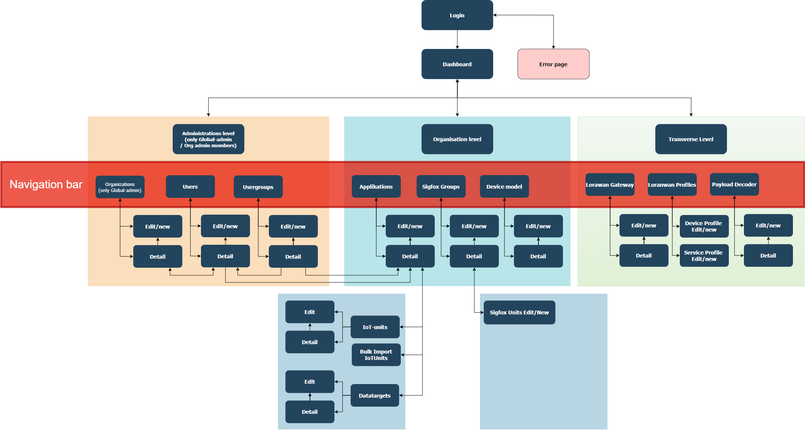
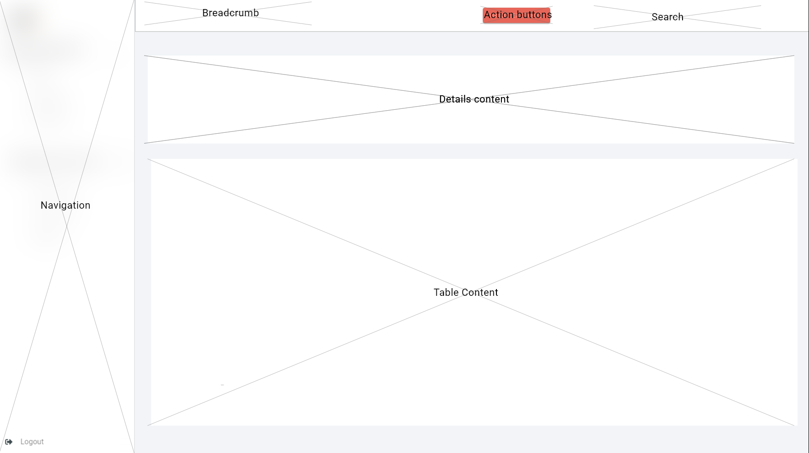

================
User Interface Design
================

The following section describes the user
interface for the OS2IoT solution -how it will look and function, and
how the flow between different pages will be..

The project will manage and surveil IoT devices for the users of OS2IoT (OS2). The purpose is to make a
user friendly user interface where the users can perform the action
necessary in connection with setting up, monitoring and managing IoT
devices.

The target audience is developers, who are to implement the solution,
the customer who has to approve the design and testers, who are to test
the solution.

Dependencies
===============

    - The layouts, and components are developed with the help of Bootstrap 4.5. Please see the documentation on https://getbootstrap.com/docs/4.5/getting-started/introduction/

Page Structure
===============
This describes how the structure of the page is designed. 

Page Layouts
-----------------
A limited list of page layouts will be used. This will ensure that the OS2IoT continuously follows a 
consistent design and layout, that adheres to the design requirements specified by Erhvervsstyrelsen.
The following sections will describe the layouts used on the OS2IoT. The areas on each page template define different areas to which content can be added. 
Notice that for mobile devices, the areas will be stacked on top of each other, and the ordering of which the area will be stacked is documented in each section.

All layout is aquired with a navigation bar on the left and a Top-menu bar as a easy access to actions required on the page. 
The background color of the page is set to be #e5e5e5.

Boxed Full Width Layout
~~~~~~~~~~~~~~~~~~~~~~
|image2-2|
The Boxed Full Width template will use the entire full with of a browsers viewport, 
and the content is only boxed in with at .container-fluid class from Bootstrap, which is a width with 100% at all breakpoints.

.. code-block:: HTML

  

    

        

            
Details Content

        

    

  

  

Boxed Feature width Layout
~~~~~~~~~~~~~~~~~~~~~~
|image2-1|

The Boxed Feature Width template is similar to the Boxed Full Width template. This width is contained using 
the grid system from Bootstrap with extra margins on left and right, dependent on which feature box is developed. 
Leaving an empty column on each side (marked in grey). On mobile devices the grid will remove the two empty columns on left and right side, allowing the featured areas to utilize the full width of the mobile device.

.. code-block:: HTML

  

    

        

            
Details content

        

        

            
Feature 1

        

  

Boxed Form Width Layout
~~~~~~~~~~~~~~~~~~~~~~
|image2-3|
The Boxed Form Width template is similar to the Boxed Full Width template, but has a larger margin on the left and right side. 
The Boxed feature width template will be centered with a custom class called "os2-form"

.. code-block:: HTML

    <form class="os2-form p-3 mt-4"></form>

Feature box Layout
~~~~~~~~~~~~~~~~~~~~~~
|image2-4|
The Feature Box layout template is used to, if needed a stand-alone box on the whole page. Here regular Bootstrap is required. 

.. code-block:: HTML

    

        

            <form class="p-5 jumbotron"></form> // optional to use form or a div
        

    

Mobile / Tablet
---------------
The mobil and tablet version is the same except the menu has been placed
in a header bar in accordance with the bootstrap best practices.
https://getbootstrap.com/docs/4.0/components/navbar/

Page Templates
-----------------
Every page on the OS2IoT will be based on a page template. 
Each template will have a defined page layout, and a set of placeholders (areas) to which components can be added.
In this section each template used on the customer portal is outlined along with the page layout used.

=====================  ===============  
  Template Name          Page Layout    
=====================  =============== 
Detail Template         Boxed Feature width Layout  
Form Template           Boxed Form Width Layout 
Login Template          Feature box Layout
Overview Template       Boxed Full Width Layout
List Template           Boxed Full Width Layout
=====================  ===============

Design
========
This chapter describes the overall design, navigation principles, and general components of the OS2IoT.

Navigation
--------------

This section describes the User's navigation options in the System. 
Here, the navigation options that the User has available are at the left of all the System's pages via the navigation bar and a graphical overview of the System's pages is displayed in the form of a sitemap.

Navigation bar
~~~~~~~~~~~~~~~
The navigation bar, which will always be found at the top of all pages in the System, gives the User quick access to the most used overviews in the System. These are shown in the tablet

+------------+-----+-------------------------------------------------------------------------------------------------------+
|            | #   | Specification                                                                                         |
+============+=====+=======================================================================================================+
|            | 1   | By pressing "the logo", the User is navigated to the dashboard                                        |
|            +-----+-------------------------------------------------------------------------------------------------------+
|            | 2   | By pressing "Users", the User is navigated to the user overview                                       |
|            +-----+-------------------------------------------------------------------------------------------------------+
|            | 3   | By pressing "Usergroups", the User is navigated to the usergroup overview                             |
|            +-----+-------------------------------------------------------------------------------------------------------+
|            | 4   | By pressing "Organizations", the User is navigated to the organization overview                       |
|            +-----+-------------------------------------------------------------------------------------------------------+
|            | 5   | By pressing "Applications", the User is navigated to applications overview                            |
|            +-----+-------------------------------------------------------------------------------------------------------+
| |image3|   | 6   | By pressing "Sigfox Administration", the User is navigated to a overview of sigfox groups             |
|            +-----+-------------------------------------------------------------------------------------------------------+
|  NavBar    | 7   | By pressing "Device Model", the User is navigated to the Device model overview                        |
|            +-----+-------------------------------------------------------------------------------------------------------+
|            | 8   | By pressing "LoRaWan Gateways", the User is navigated to the Gateways overview                        |
|            +-----+-------------------------------------------------------------------------------------------------------+
|            | 9   | By pressing "LoRaWan Profiles", the User is navigated to the overview of service and device profiles  |
|            +-----+-------------------------------------------------------------------------------------------------------+
|            | 10  | By pressing "Payload Decoder", the User is navigated to the payload decoder overview                  |
|            +-----+-------------------------------------------------------------------------------------------------------+
|            | 11  | By pressing "Logout", the User is navigated to the login page                                         |
+------------+-----+-------------------------------------------------------------------------------------------------------+

‘Sitemap’
~~~~~~~~~~~~~~~

This section describes the flow between the pages.

|image1|

The flow chart above is a simplified view of the structure of the
application. 

When login in you'll be welcomed with a dashboard, and you will have accessible features shown in the navigation bar.
In short you can navigate forth and back in, and you can access all first level pages at all times through the navigation bar (see the red box) 

Futhermore, to get transparency for the user to understand which are transverse or organizational filtered features the navigation menu is divided into three topics in which they each serve an purpose: 

    -  **Administration level**  - Is only visible for Global Administrator and Organization Administrator, and is controlling the read and write rights for the members of each application
    -  **Organization level**  - Is where you can add Applications, Sigfox Administration, and Device Models to a certain organization.  
    -  **Transverse level**  - is where you can create cross-cutting Gateways, Payload Decoder, and LoRaWan Profiles so all organizations can use these features or add-ons.

From the application you can futhermore add-on datatarget and IoT-devices to the newly created application, thus the sub-box as shown on the sitemap.
In order to get transparency on integrating the Sigfox Administration you first have to get the Sigfox group and then the unit, thus the sub-box as shown on the sitemap.

User Rights
------------------------------------------
It requires a certain right to be able to access certain features with global-admin, organizations admin, or write/read features.

Navigation to the systeme with global-admin functions is done by 
    1) adding a whole section for administrative use for global-admin to control the system of user, user groups(permissions), and organizations
    2) adding new organizaions to the system
    3) given write rights (delete and edit) to everything inside the organization
    4) activation of another global-admin user

Navigation to the system with organization-admin functions is done by 
    1) adding system control of user, user groups (permissions) to the organization pane
    2) given write rights (delete and edit) to everything inside the organization

Navigation to the system with write functions is done by 
    1) given write rights (delete and edit) to everything inside the organization

Navigation to the system with read functions is done by 
    1) given read rights and cannot delete or edit anything inside the organization

Global Search
--------------
The search box is placed in the top right corner in the top bar menu. This is the only search input field in the application.
Global search is used to search across entities in OS2IoT, this is done via free text search which is activated from the search icon in the top menu.
When searching in global search, the result is not displayed as in other searches, since in global search, several entities can be searched at the same time. 
The result is displayed instead on a single page where both the data type and selected data for this data type are displayed. 
The following entities are searchable via global search:
    - Applications
    - IoT-devices
    - Gateways

Indexed fields for free text search
~~~~~~~~~~~~~~~
To minimize irrelevant search results, not all fields are indexed to the global search. 
For example, it will i.a. be possible to seek a application on the basis of the application name, or application id, 
but not on e.g. the creation date, as searches on dates would otherwise yield too many irrelevant results.
Some latency (delay) can be expected after an item has been modified or created. 

Field Types
--------------

Input
~~~~~~~~~~~~~~~

Help
--------------
Help icons are placed on the right side above input fields in the forms.
Clicking them opens a small text box next to the icon.

Validations
--------------
Validations are handled on the server side.

Error messages
--------------

Error messages will be the bootstrap alerts.
https://getbootstrap.com/docs/4.0/components/alerts/

Edit
--------------
Handled server side. An api is called when saving, editing or deleting
items.
Delete
---------------------
Handled server side. An api is called when saving, editing or deleting
items.

Listview
--------------
Tables
~~~~~~~~~~~~~~~
PointList
~~~~~~~~~~~~~~~
Tab order & Shortcuts
---------------------

The tab order will be from top to bottom and left to right in a columnal
fashion for all interactive elements . See the below image for further
details.

Security
========
The user interface is developed responsively according to the rights (user system roles) and data boundaries the user is assigned in usergroups. 
A description of user system roles and data delimitations can be found in User Rights, as well as a description of what each user system role provides access to in the system. 
In addition, some suggested job function roles (groups of user system roles from Kombit Adgansstyring). 
In general, the user interface acts in three ways, to enforce the user's rights in OS2IoT, 
these are to hide action buttons for the user, mask data on lists and deny access to parts of the solution.

Hide components and buttons
---------------------
Action Buttons in tables and list on overview pages are hidden if the user does not have rights to use / view them.
[Picture] shows a user with write access to a certain organisation and cannot delete a device profile if not granted the rights to it 
[Picture] shows a organisation admin with visible buttons in the same view. 

|image|
|image|

Access denied
---------------------
If the user actively changes the URL to access a applications, details pages or anything else he may not have access to, 
according to his user system roles and associated data boundaries, he will be redirected to an empty page with HTTP error response in the header. 
|image|

.. |image2-1| image:: ./media/image2-1.png

.. |image2-3| image:: ./media/image2-3.png
.. |image2-4| image:: ./media/image2-4.png
.. |image3| image:: ./media/image3.png
    :width: 200px

