User-Interface Design
=================================

Introduction
------------

Purpose and target audience
~~~~~~~~~~~~~~~~~~~~~~~~~~~

The purpose of this document is to describe and document the user
interface for the OS2IoT solution -how it will look and function, and
how the flow between different pages will be..

The target audience is developers, who are to implement the solution,
the customer who has to approve the design and testers, who are to test
the solution.

Delimitation
~~~~~~~~~~~~

The project will create a new web application for setting up, managing
and surveil IoT devices for the customer (OS2). The purpose is to make a
user friendly user interface where the users can perform the action
necessary in connection with setting up, monitoring and managing IoT
devices.

‘Sitemap’
---------

This section describes the flow between the pages.

|image1|

Structure
~~~~~~~~~

The flow chart above is a simplified view of the structure of the
application. All the first level pages are available at all times
through the navigation menu (except when a form is open). Applications
can be added from both the dashboard and the “Mine applikationer” pages.
The dashboard, in essence, is a simplified combination of “Mine
applikationer” and “Alle IoT enheder”.

“Opret ny applikation” and “Tilføj IoT enhed” lead to each their form
where there is a linear, narrow flow of one and five steps,
respectively. The user can navigate back and forth through forms.

Logical flow
~~~~~~~~~~~~

See section 2.1. In short you can navigate back and forth in forms, you
can access all main pages via the navigation menu and from these main
pages you can access the forms.

Page structure
--------------

On the main pages the navigation menu is placed in the left column
(col-3 in bs).

|image2|

In the forms the navigation menu is hidden and instead ther eis a top
menu that is used to show the progress of the form and to offer the
navigation back to the parent-page.

|image3|

Main components
~~~~~~~~~~~~~~~

-  Left menu (navigation menu)

-  Content page

-  Forms (in essence emodals)

Tab order
~~~~~~~~~

The tab order will be from top to bottom and left to right in a columnal
fashion for all interactive elements . See the below image for further
details.

|image4|

Page elements
-------------

Standard validations
~~~~~~~~~~~~~~~~~~~~

Validations are handled on the server side.

Search boxes
~~~~~~~~~~~~

The search box is placed in the top left corner next to the logo which
also doubles as a home button to the dashboard. This is the only search
input field in the application.

Help
~~~~

Help icons are placed on the right side above input fields in the forms.
Clicking them opens a small textbox next to the icon.

|image5|

Page
^^^^

The background color of the page is #e5e5e5. It is built using the best
practices principles from bootstrap.

Field
^^^^^

Using bootstrap fileds.

Date picker
~~~~~~~~~~~

No date picker is used. If a date picker is used it will be the
bootstrap datepicker.

Error messages
~~~~~~~~~~~~~~

Error messages will be the bootstrap alerts.
https://getbootstrap.com/docs/4.0/components/alerts/

Undo and save functions
~~~~~~~~~~~~~~~~~~~~~~~

Handled server side. An api is called when saving, editing or deleting
items.

Receipts
~~~~~~~~

Bootstrap alerts are used to verify to the user that their action was
successful.

Wire frames
-----------

The solution can be found at:
https://www.figma.com/proto/dWWZ3nNsM0GBnwnYQPTrIj/OS2iot---frontend-design?node-id=2%3A0&viewport=-800%2C-85%2C0.5&scaling=min-zoom

The mobil and tablet version is the same except the menu has been placed
in a header bar in accordance with the bootstrap best practices.
https://getbootstrap.com/docs/4.0/components/navbar/

Dashboard
~~~~~~~~~

|image6|

Mine applikationer (My applications)
~~~~~~~~~~~~~~~~~~~~~~~~~~~~~~~~~~~~

|image7|

Alle IoT enheder (All IoT units)
~~~~~~~~~~~~~~~~~~~~~~~~~~~~~~~~

|image8|

Opret ny applikation (Create new application)
~~~~~~~~~~~~~~~~~~~~~~~~~~~~~~~~~~~~~~~~~~~~~

|image9|

Tilføj en ny IoT enhed (Add new IoT unit)
~~~~~~~~~~~~~~~~~~~~~~~~~~~~~~~~~~~~~~~~~

|image10|\ |image11| |image12| |image13| |image14|

IoT unit
~~~~~~~~

|image15|

Reports
-------

Emails
------

SMS
---

.. |image0| image:: ./media/image4.emf
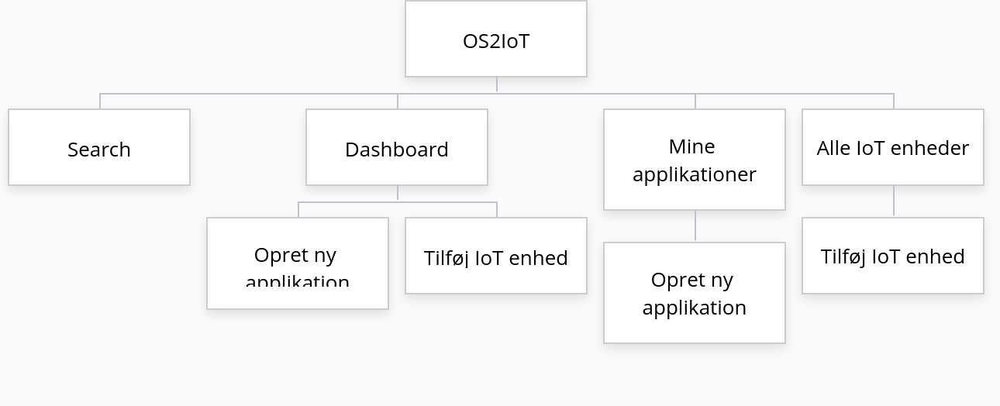
.. |image2| image:: ./media/image6.png
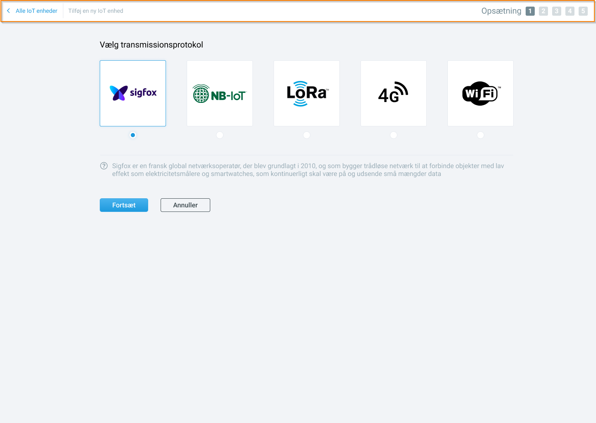
.. |image4| image:: ./media/image8.png
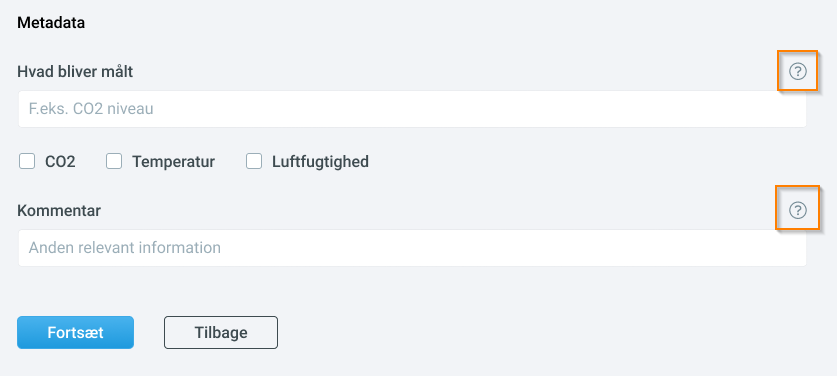
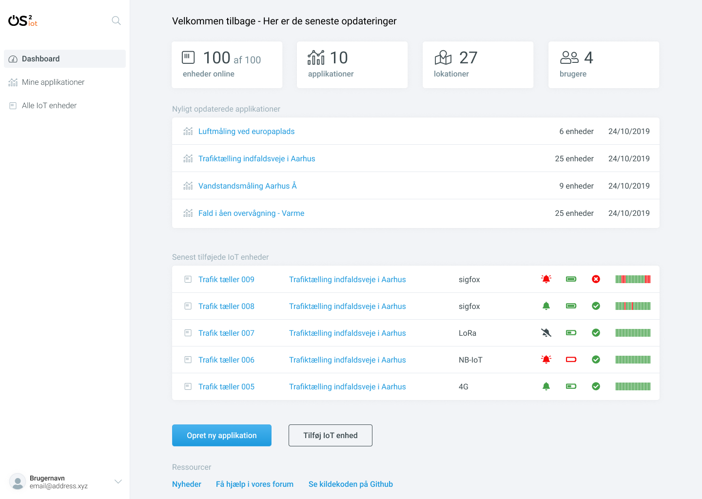
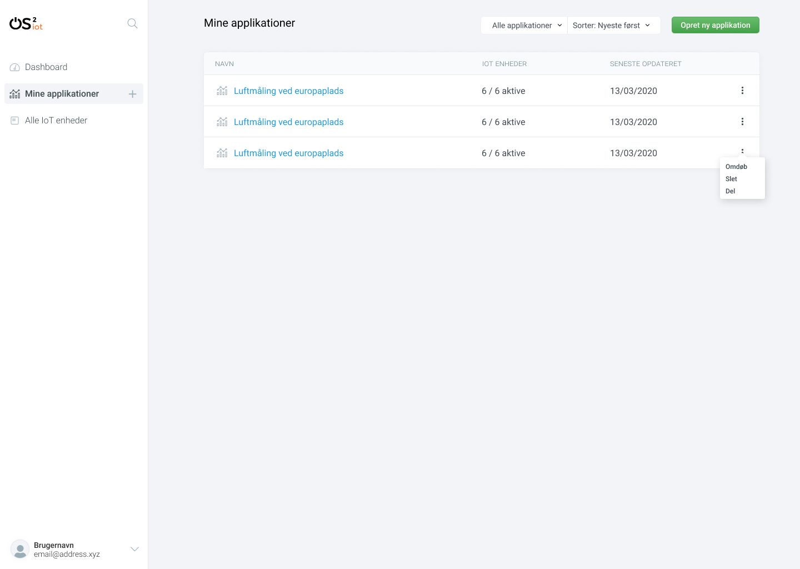
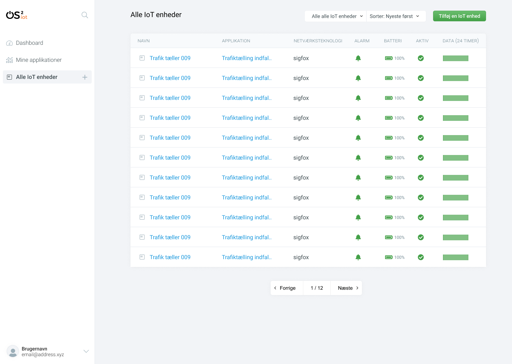
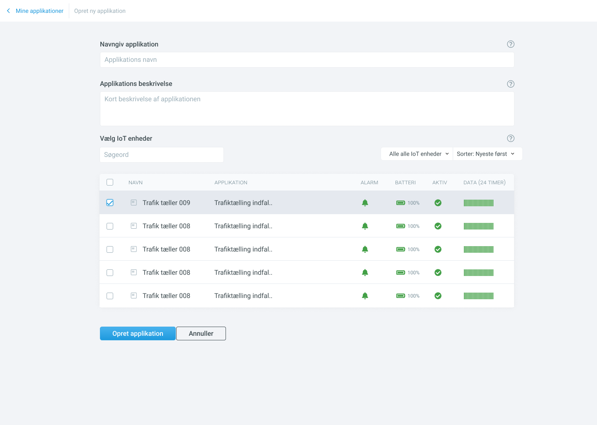
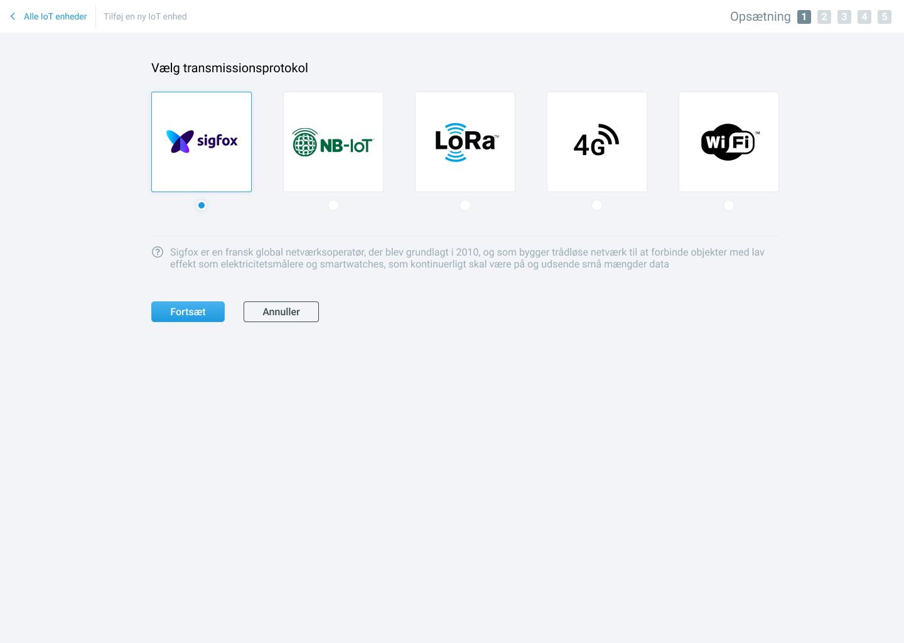
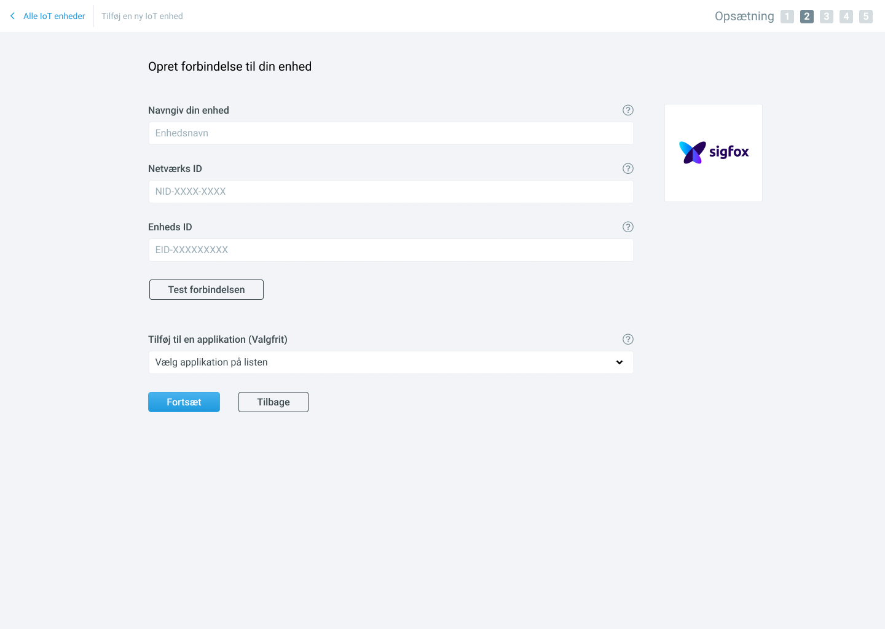
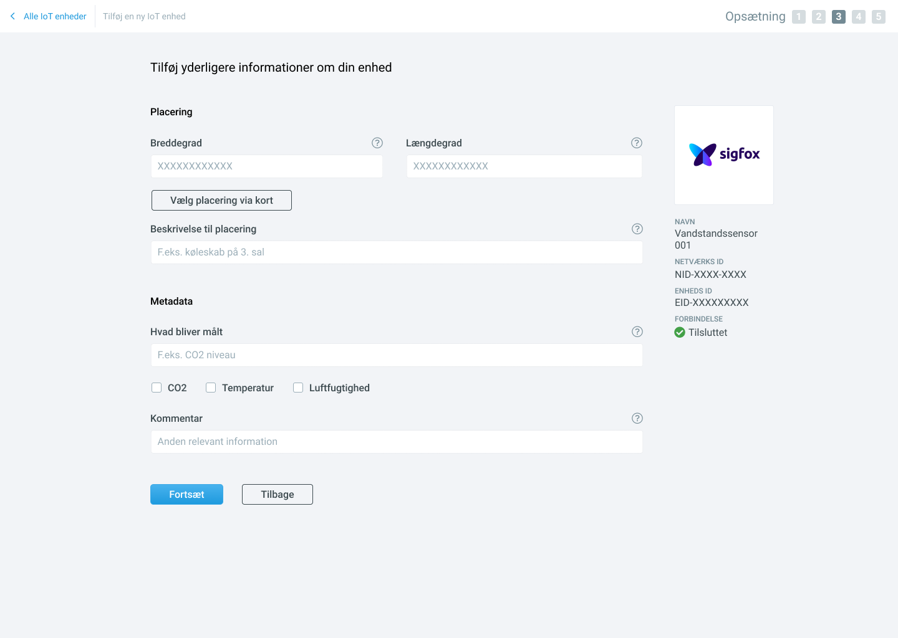
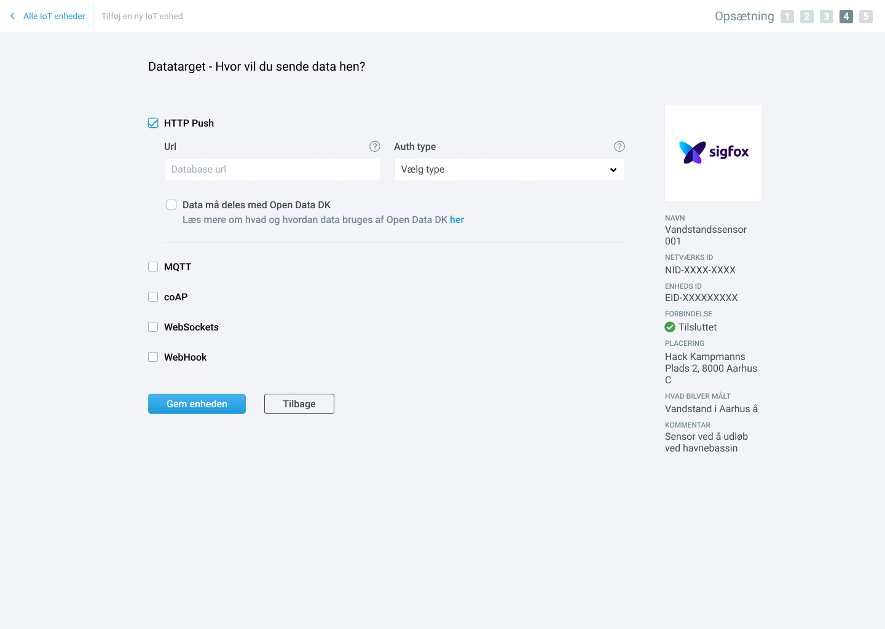
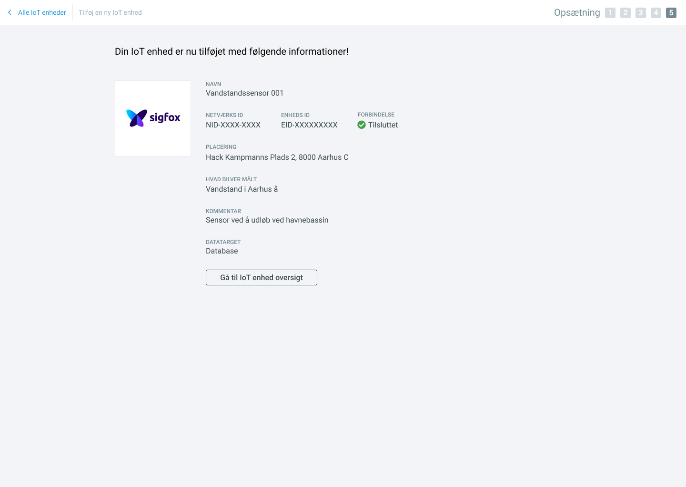
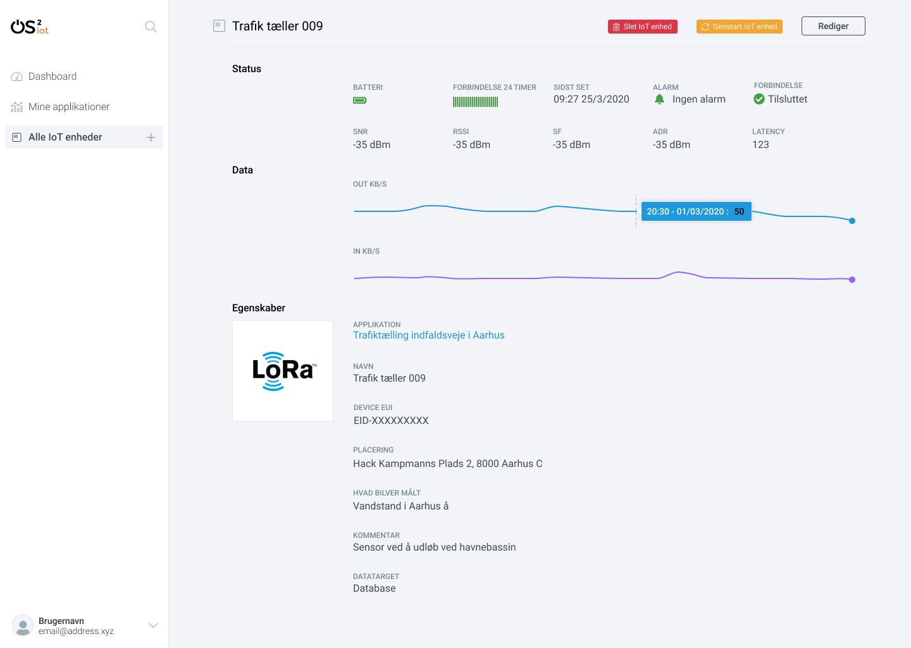
