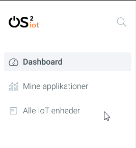

User-Interface Guidelines
===================================

Background
----------

OS2 has provided NC with design documents for the frontend application
for the OS2IoT project. This document is written with the goal of
highlighting and detail the wants and needs of the customer for the
application to adequately perform as expected. This also servers to let
the frontend developer of the application have a clear idea of what the
vision is and what should be implemented.

General principles
------------------

This is not a specific design of a page layout, but rather a description
of how the different elements are designed – the principles of design,
if you will. Although an actual detailed design exist, this serves to
help navigate if deviations, changes or additions should occur. In those
cases this document can be used a base for creating or changing
components. The frontend solution will be referred to as the app during
the rest of this document.

Main navigation
~~~~~~~~~~~~~~~

The app will have a main navigation menu in the left column. This is
solely used to switch between the different main pages of the app.

The Dashboard page will be the landing page of the app. On the top left
the logo functions as a home button. The header will contain a search
input field stretching thereby removing it from the navigation menu
where it is displayed in the image below.

|image1|

The active and hovered menu item is highlighted by a grey
background-color and bold font (font-weight: 600). Other menu items have
a thin font-weight of 300.

If the page connected to a menu item has a specific single option to add
more like e.g. “Mine applikationer” (My applications) has the ability to
ad a new application, the a shortcut to add this will be displayed on
the right side of the menu item when hovering it or when active.

Use of keyboard
~~~~~~~~~~~~~~~

No shortcuts have been defined for the app.

The tab order will be from top to bottom and left to right in a columnal
fashion for all interactive elements . See the below image for further
details.

No right-click or double-click functions in this solution.

Flow for deleting information
~~~~~~~~~~~~~~~~~~~~~~~~~~~~~

If elements are deletable this will be visible via a vertical “…” button
next to it. Clicking or hovering this will show a menu of available
options, such as delete, rename or share. When deleting the user should
be prompted a dialog informating of the action and/or consequences and
if the wish to continue with the action.

Help functions
~~~~~~~~~~~~~~

At the bottom of the page there will be a link to a forum where the user
can search for help. Should there be tooltips?

Usability considerations
------------------------

Existing conventions are used such as highlighting interactable elements
using color and background-color. The most relevant information are
furthest to the left and only relevant information is displayed for the
user.

The design will include clear visual hierarchies grouping the different
elements such that the user is easily able to differentiate the
different types of information on the page. See the image below:

Using bootstrap 4 will help including the existing conventions that
usears are used to from many other applications.

Accessibility considerations
----------------------------

WCAG will be taken into consideration for this app as this has been
requested by the customer. WCAG is concerned with making the web page
accessible to all users such as vision or movement impaired users, but
also many others. Please refer to the official WCAG site for more
information about this.
https://www.w3.org/WAI/standards-guidelines/wcag/

Access to Siteimprove account will be provided by the customer and is
used to continually assess the accessibility of the app.

`WCAG AA <#RANGE!_Toc378677835>`__
~~~~~~~~~~~~~~~~~~~~~~~~~~~~~~~~~~

The WCAG 2.1 standard will be used for this app. See
https://www.w3.org/WAI/WCAG21/Understanding/

Guidelines
^^^^^^^^^^

See https://www.w3.org/WAI/standards-guidelines/wcag/

Graphics – and other resources of non-textual character
^^^^^^^^^^^^^^^^^^^^^^^^^^^^^^^^^^^^^^^^^^^^^^^^^^^^^^^

In accordance with the official WCAG 2.1 documentation any graphical
elements on the page, such as icons, must have a contrast ratio of at
least 3:1. In case an icon, or more likely a logo, has more colors the
contrast ratio should be tested for each of the touching colors – each
should have a 3:1 contrast ratio. Many resources are available for
testing this, such as https://webaim.org/resources/contrastchecker/

Furthermore the app should take into considerations the needs for color
blind users in accordance with the legal requirements in 1.4.1 in WCAG
about use of color
https://www.w3.org/TR/UNDERSTANDING-WCAG20/visual-audio-contrast-without-color.html
.

Form-elements
^^^^^^^^^^^^^

Same principles apply as for section 4.1.2

Keyboard-accessibility 
^^^^^^^^^^^^^^^^^^^^^^^

In accordance with the official WCAG guidelines in section 2.1 –
Keyboard Accessible. See
https://www.w3.org/TR/UNDERSTANDING-WCAG20/keyboard-operation.html

Page structure
--------------

Responsive design and screen resolution
~~~~~~~~~~~~~~~~~~~~~~~~~~~~~~~~~~~~~~~

The page will be responsive using the Bootstrap framework.

Grid
^^^^

Bootstraps regular 12-grid is used.

Desktop 
^^^^^^^^

Left menu will be used. Otherwise follow the images and descriptions
provided throughout this document.

Tablet
^^^^^^

For smaller screen sizes the design will follow the principles provided
by bootstrap 4. The left side navigation menu will be moved to the
bottom of the screen (in the footer) and can be opened as a modal. The
footer will contain a “menu”, “search” and a “user” item. The following
image is a sketch and not an actual screenshot of how the footer menu
will look like:

Mobile
^^^^^^

Same priciples as tablet.

Positioning of cursor
~~~~~~~~~~~~~~~~~~~~~

Regular position of cursor and existing conventions of using a pointer
when elements are clickable and cursor: text when an text can be
selected or in text inputs.

Tab-sequence
~~~~~~~~~~~~

See section 2.2

HTML guide and Bootstrap
~~~~~~~~~~~~~~~~~~~~~~~~

The general guidelines for the visual design and for the use of
bootstrap, css and js can be found at:
https://github.com/itk-dev/datatidy/tree/develop/assets

Page elements
-------------

A colour scheme has been provided by OS2 and can be found in the
base.scss file at
https://github.com/itk-dev/datatidy/blob/develop/assets/scss/base.scss

Modal windows
~~~~~~~~~~~~~

Except menu and search modals for mobile and tablet views the app will
not include modals. The menu and search modals will be full screen size
modals sliding up from the bottom of the screen when the corresponding
menu item is pushed. The modals will be closable by clicking a close”X”
icon on the top right or by pressing the back button of the device.

Links
~~~~~

Bold font, light blue, otherwise like bootstrap convention.

Text
~~~~

Font for all text in the app is Roboto.

Headlines
~~~~~~~~~

Black color, h2 elements.

Pictures
~~~~~~~~

Alt text and titles should be provided.

Icons
~~~~~

Fontawesome icons are used

Tables
~~~~~~

Materials tables are used and styled 

Input fields
~~~~~~~~~~~~

Follow the standard bootstrap 4 approach using the color scheme for the
project provided by OS2.

Buttons
~~~~~~~

Follow the standard bootstrap 4 approach using the color scheme for the
project provided by OS2.

Radio buttons
~~~~~~~~~~~~~

See the following image:

Otherwise follow the bootstrap 4 approach.

Check boxes
~~~~~~~~~~~

Use bootstrap 4 checkboxes and style them as seen below:

Dropdowns, combo-boxes
~~~~~~~~~~~~~~~~~~~~~~

Use bootstrap 4 dropdowns.

Date fields and use of date pickers
~~~~~~~~~~~~~~~~~~~~~~~~~~~~~~~~~~~

Use bootstrap 4 fields.

Error messages/feedback
~~~~~~~~~~~~~~~~~~~~~~~

Implemented in accordance with Bootstrap
https://getbootstrap.com/docs/4.0/components/alerts/

Flow pages
~~~~~~~~~~

(tab-controls to navigate in the various steps in the flow)

Browser support
---------------

Should be compatibale with newest versions of Edge and Chrome dating two
versions back. If not, the users can be notified that they need to
update their browser.

Encoding
--------

UTF-8 encoding is used.

Best practices
--------------

HTML standards
~~~~~~~~~~~~~~

The HTML 5 standards are used. Should comply with Bootstrap and WCAG
(for screen reading software).

In general
^^^^^^^^^^

Use best practices for HTML. Mostly the HTML should be written based on
Bootstrap components.

Microdata
^^^^^^^^^

There are no search engines or the like to take into account, but screen
reading software needs to be able to read the HTML. Using best practices
this should ensure sufficient readability.

CSS
~~~

Reusability is the keyword. The CSS (SCSS) should be structured in
components that are reusable throughout the page.

.. _in-general-1:

In general
^^^^^^^^^^

Use BEM convention for CSS development and naming when possible.

SCSS
^^^^

Variables
'''''''''

Variables will be kept in a variables.scss file. They should be written
with a structure where first you imply what it is and then the
variation, like:

.. code:: css

   $alert-success;

   $alert-warning;

   $alert-error;

   Or:

   $blue;

   $blue-light;

   $blue-dark;

Nesting
'''''''

Use BEM convention when possible.

Mixins (functions)
''''''''''''''''''

Use mixins (end extends) when possible to avoid repetition. Naming
convention is the same as for variables.

Inclusion of CSS
^^^^^^^^^^^^^^^^

The SCSS is compiled to a CSS file that is included the header of the
app. This is performed automatically in the process of compiling the
Angular application.

JavaScript
~~~~~~~~~~

In accordance with the Angular best practices TypeScript is used and
compiled to JavaScript. As of the date of writing this document the
newest version of Angular (9.1) uses TypeScript 3.8. This supports the
newest browsers in accordance with the agreement with the customer and
thus this is used.

.. _in-general-2:

In general
^^^^^^^^^^

The typescript files are locatedin the src folder and compiled to a .js
file when building the app. This is situated in the dist folder. Using
TypeScript should be done in accordance with the best practices provided
in the Angular documentation https://angular.io/docs

Information architecture principles
-----------------------------------

-  Better to go deep than wide (customer wishes to minimize clutter and
   present only the needed information)

-  Avoid modals when possible and instead present information via depth.

-  Keep users on a narrow track and make sure they do not stray too
   much.

-  There will be no customization options for the app

Content guidelines
------------------

Only elements such as titles, select options, links, buttons, input
fields, etc are named programmatically. The content is user generated.

