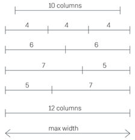
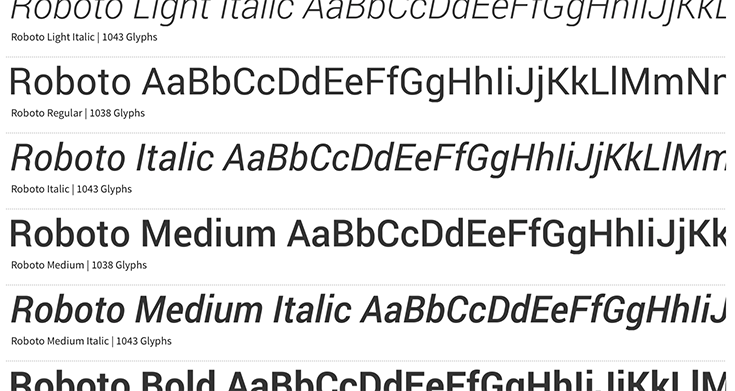
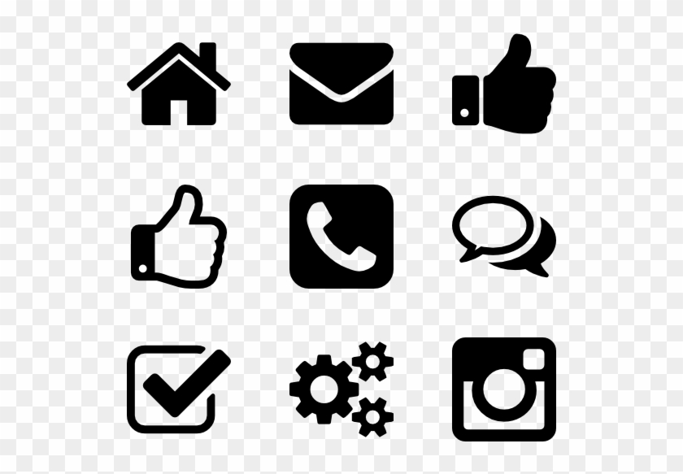
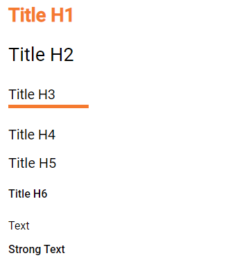

User-Interface Guidelines
===================================

Background
----------
This document is written with the goal of
highlighting and detail the wants and needs of the customer for the
application to adequately perform as expected. This also servers to let
the frontend developer of the application have a clear idea of what the
vision is and what should be implemented.

General principles
------------------

This is not a specific design of a page layout, but rather a description
of how the different elements are designed – the principles of design,
if you will. Although an actual detailed design exist, this serves to
help navigate if deviations, changes or additions should occur. In those
cases this document can be used a base for creating or changing
components. The frontend solution will be referred to as the app during
the rest of this document.

Main navigation
~~~~~~~~~~~~~~~

The app will have a main navigation menu in the left column. This is
solely used to switch between the different main pages of the app.

The Dashboard page will be the landing page of the app. On the top left
the logo functions as a home button. The top header will contain a search
input field stretching thereby removing it from the navigation menu
where it is displayed in the image below.

|image1|

Use of keyboard
~~~~~~~~~~~~~~~

No shortcuts have been defined for the app.

The tab order will be from top to bottom and left to right in a columnal
fashion for all interactive elements . See the below image for further
details.

No right-click or double-click functions in this solution.

Ease of Use & Accessibility
---------------------------
WCAG AA
~~~~~~~
OS2IoT is partially designed based on current user-friendliness standards, as defined in:

   • W3C standards see https://www.w3.org
   • The guidelines in WCAG 2.1 Level AA, see http://www.w3.org/TR/WCAG21/.

Although, OS2IoT is an internal system used within the organization and therefore is **not** WCAG Compliant. 
But as Web Content Accessibility Guidelines (WCAG) 2.1 includes a wide range of recommendations on how to make web content widely available, 
there have been some considerations regarding user friendliness, and partly because: 

   1) Following these guidelines can ensure accessibility for a larger group of people with disabilities, including the blind and partially sighted, deaf and hard of hearing, people with learning disabilities, cognitive limitations, limited mobility, speech impairment and photosensitivity, and people with combinations thereof. 
   2) Following these guidelines will also often make web content more user-friendly in general.
   3) And in order to provide the necessary degree of accessibility that commits Erhvervsstyrelsen, this document will briefly mention the key points from WCAG, so that developers have the best possible conditions for making qualified decisions to increase accessibility. 

Principles of WCAG
^^^^^^^^^^^^^^^^^^
Therefore, OS2IoT will use the best practices of level AA where four principles are set out which form the foundation and success criterion for web accessibility:
   
   - **Perceivable:** Users of adult education must be able to perceive the information presented. Information and user interface components must not be invisible to all the user's senses.
   - **Applicable:** Adult education users must be able to operate user interface components, and these must not require interaction that a user cannot perform.
   - **Understandable:** Information and the use of the user interface must be intuitively understandable by the users of adult education.
   - **Robust:** Content must be robust enough to be reliably interpreted with a wide range of user agents, including aids such as screen readers and the like.

It is necessary for developers or other stakeholders to know and adhere to the above principles when developing task, stories or user interface components for the solution.

Keyboard-accessibility 
^^^^^^^^^^^^^^^^^^^^^^^

In accordance with the official WCAG guidelines in section 2.1 –
Keyboard Accessible. See
https://www.w3.org/TR/UNDERSTANDING-WCAG20/keyboard-operation.html

Graphics – and other resources of non-textual character
^^^^^^^^^^^^^^^^^^^^^^^^^^^^^^^^^^^^^^^^^^^^^^^^^^^^^^^

In accordance with the official WCAG 2.1 documentation any graphical
elements on the page, such as icons, must have a contrast ratio of at
least 3:1. In case an icon, or more likely a logo, has more colors the
contrast ratio should be tested for each of the touching colors – each
should have a 3:1 contrast ratio. Many resources are available for
testing this, such as https://webaim.org/resources/contrastchecker/

Furthermore the app should take into considerations the needs for color
blind users in accordance with the legal requirements in 1.4.1 in WCAG
about use of color
https://www.w3.org/TR/UNDERSTANDING-WCAG20/visual-audio-contrast-without-color.html

Guidelines
^^^^^^^^^^^^^^^^^^
Under the principles there are guidelines. The guidelines are the basic goals or best practices that developers, editors, 
and UXs should work toward to make content more accessible to users with various disabilities. 
The guidelines are not testable, but provide the framework and overall objectives that can help editorial staff 
understand the success criteria and implement the techniques better.
A large number of the guidelines WCAG sets out have been taken into account in the markup provided in the HTML guide. 
By being loyal to the HTML guide's instructions, many guidelines will be implicitly followed.
THe following sections is a list of guidelines that developers on the project are expected to follow:

Page principles
---------------
Below is a description of guidelines for page structure, as well as a description of the expected production in the defined breakpoints 
for responsive web design.

Responsive design and screen resolutions
~~~~~~~~~~~~~~~~~~~~~~~~~~~~~~~~~~~~~~~~~~
The solution is designed according to the desktop-first principle. The design is based on the solution working
optimally on larger screens, and that the information presented is displayed clearly.
On smaller screens, the same information will be available, and all functions can also be accessed via 
touch devices. Some pages such as the detailed overview are also optimized for tablets.

Grid (adaptation for tablet and mobile)
^^^^^^^^^^^^^^^^^^^^^^^^^^^^^^^^^^^^^^^^
A responsive grid is used. A 12-column grid from the framework Bootstrap 4.5 is used. 
The design of screens must in principle accommodate desktop views first, then tablets and mobile.

|image2-1|
 
Breakpoints are given by Bootstrap's responsive grid. If needed, the number of columns in the grid can be expanded. 5 breakpoints are used:

|image2-2|

As a starting point, the content of OS2IoT fills with a max-width of 1140px. 
The last pixels are used for margins so that the contents of the system do not stick to the edge of the screen.
As a starting point, Bootstrap uses a fixed pixel value for the width of the content on large screens (1200px).

4.1.2 Screen resolution
^^^^^^^^^^^^^^^^^^^^^^^^
OS2IoT is designed as a starting point for the resolution 1280 * 1024 (desktop-first).

Positioning of cursor
~~~~~~~~~~~~~~~~~~~~~

Regular position of cursor and existing conventions of using a pointer
when elements are clickable and cursor: text when an text can be
selected or in text inputs.

4.3 Tab sequence
~~~~~~~~~~~~~~~~~~~~~~~~~~~~~~~~~~~~~~~~~~
If no tab index is explicitly defined, the tab sequence on all pages will be from the top left corner to the right and then down.

4.4 The HTML Guide, Bootstrap, and Google Materials
~~~~~~~~~~~~~~~~~~~~~~~~~~~~~~~~~~~~~~~~~~~~~~~~~~~
These points has to be considered before developing further:
   - Bootstrap is an open source framework consisting of front-end resources. It consists of a collection of tools for creating components and technical behavior on websites and web applications.
   - In connection with this solution, Materials has been expanded to form the basis of the elements that underlies the HTML guide. 
   - In addition, responsive breakpoints for the solution are defined by Bootstrap's default values ​​for the same, just as responsive customization is provided by Bootstrap's codebase.
   - All webparts must use the HTML guide and must have consistent design patterns and look and feel. 
   - OS2IoT's HTML guide and especially the prototype must serve as a starting point for the entire user interface and all its elements. Below, use is made of the elements, classes and methods found in the guide. 
   - The templates and design principles developed by Erhvervsstyrelsen must be used in the project. 
   - New templates must conform to these.
   - The framework includes HTML and SCSS-based design templates for style, forms, buttons, charts, navigation, and other user interface components.
   - In this project,Materials is used partly as a toolbox for aesthetics and functionality in relation to the aforementioned components, and not least as a base for implementing responsive design. This also means that the only thing that is corrected in relation to Bootstrap's standard cuddle base is the file containing variables for style, colors, margins, etc.

Page elements
-------------

A colour scheme has been provided by OS2 and can be found in the base.scss file at
https://github.com/itk-dev/datatidy/blob/develop/assets/scss/base.scss

Modal windows
~~~~~~~~~~~~~

Except menu and search modals for mobile and tablet views the app will
not include modals. The menu and search modals will be full screen size
modals sliding up from the bottom of the screen when the corresponding
menu item is pushed. The modals will be closable by clicking a close”X”
icon on the top right or by pressing the back button of the device.

Links
~~~~~

Bold font, light blue, otherwise like bootstrap convention.

Text
~~~~

Font for all text in the app is Roboto.

|image3|

Fonts and typography deal with the selected fonts, as well as formatting and use of text and headings.

|image5|

Headings are both a visual tool and a structure in the code that matter to users who use screen readers. It is possible to follow a strict structure in headings for screen readers and at the same time adapt the visual expression of the headings to users who orient themselves visually.

Pictures
~~~~~~~~

Alt text and titles should be provided.

Icons
~~~~~

Fontawesome icons is used

|image4|

Tables
~~~~~~

Materials tables are used and styled 

Input fields
~~~~~~~~~~~~

Follow the standard bootstrap 4 approach using the color scheme for the
project provided by OS2.

Buttons
~~~~~~~

Follow the standard bootstrap 4 approach using the color scheme for the
project provided by OS2.

Dropdowns
~~~~~~~~~~
If elements are deletable this will be visible via a vertical “…” button
next to it. Clicking or hovering this will show a menu of available
options, such as delete, rename or share. When deleting the user should
be prompted a dialog informating of the action and/or consequences and
if the wish to continue with the action.

Radio buttons
~~~~~~~~~~~~~

See the following image:

Otherwise follow the bootstrap 4 approach.

Check boxes
~~~~~~~~~~~

Use bootstrap 4 checkboxes and style them as seen below:

Dropdowns, combo-boxes
~~~~~~~~~~~~~~~~~~~~~~

Use bootstrap 4 dropdowns.

Date fields and use of date pickers
~~~~~~~~~~~~~~~~~~~~~~~~~~~~~~~~~~~

Use bootstrap 4 fields.

Error messages/feedback
~~~~~~~~~~~~~~~~~~~~~~~

Implemented in accordance with Bootstrap
https://getbootstrap.com/docs/4.0/components/alerts/

Flow pages
~~~~~~~~~~

(tab-controls to navigate in the various steps in the flow)

Browser support
---------------

Should be compatibale with newest versions of Edge and Chrome dating two
versions back. If not, the users can be notified that they need to
update their browser.

Encoding
--------

UTF-8 encoding is used.

Best practices
--------------

HTML standards
~~~~~~~~~~~~~~

The HTML 5 standards are used. Should comply with Bootstrap and WCAG
(for screen reading software).

In general
^^^^^^^^^^

Use best practices for HTML. Mostly the HTML should be written based on
Bootstrap components.

Microdata
^^^^^^^^^

There are no search engines or the like to take into account, but screen
reading software needs to be able to read the HTML. Using best practices
this should ensure sufficient readability.

CSS
~~~

Reusability is the keyword. The CSS (SCSS) should be structured in
components that are reusable throughout the page.

.. _in-general-1:

In general
^^^^^^^^^^

Use BEM convention for CSS development and naming when possible.

SCSS
^^^^

Variables
'''''''''

Variables will be kept in a variables.scss file. They should be written
with a structure where first you imply what it is and then the
variation, like:

.. code:: css

   $alert-success;

   $alert-warning;

   $alert-error;

   Or:

   $blue;

   $blue-light;

   $blue-dark;

Nesting
'''''''

Use BEM convention when possible.

Mixins (functions)
''''''''''''''''''

Use mixins (end extends) when possible to avoid repetition. Naming
convention is the same as for variables.

Inclusion of CSS
^^^^^^^^^^^^^^^^

The SCSS is compiled to a CSS file that is included the header of the
app. This is performed automatically in the process of compiling the
Angular application.

JavaScript
~~~~~~~~~~

In accordance with the Angular best practices TypeScript is used and
compiled to JavaScript. As of the date of writing this document the
newest version of Angular (9.1) uses TypeScript 3.8. This supports the
newest browsers in accordance with the agreement with the customer and
thus this is used.

.. _in-general-2:

In general
^^^^^^^^^^

The typescript files are locatedin the src folder and compiled to a .js
file when building the app. This is situated in the dist folder. Using
TypeScript should be done in accordance with the best practices provided
in the Angular documentation https://angular.io/docs

Information architecture principles
-----------------------------------

-  Better to go deep than wide (customer wishes to minimize clutter and
   present only the needed information)

-  Avoid modals when possible and instead present information via depth.

-  Keep users on a narrow track and make sure they do not stray too
   much.

-  There will be no customization options for the app

Content guidelines
------------------

Only elements such as titles, select options, links, buttons, input
fields, etc are named programmatically. The content is user generated.

.. |image1| image:: ./media/main-navigation.png

.. |image2-2| image:: ./media/breakpoints.png

