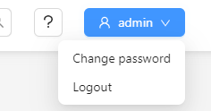

Users' notes
============

This page is meant to serve as useful information for users of the system.

Default passwords
-----------------

These passwords are the default, and should be changed in the respective systems.

========================================== ======================= =====================
System                                     Username                Password
========================================== ======================= =====================
OS2iot                                     global-admin@os2iot.dk  hunter2
OS2iot-postgres                            os2iot                  toi2so
Chirpstack                                 admin                   admin
Chirpstack-postgres                        chirpstack              chirpstack
========================================== ======================= =====================

How to change chirpstacks admin password
----------------------------------------

Step-by-step:
#############

1. Log in to the ChirpStack Application Server web interface using the default credentials
2. Change the password of the admin user by clicking the blue "admin" button in the top right corner -> Change password

|image1|

